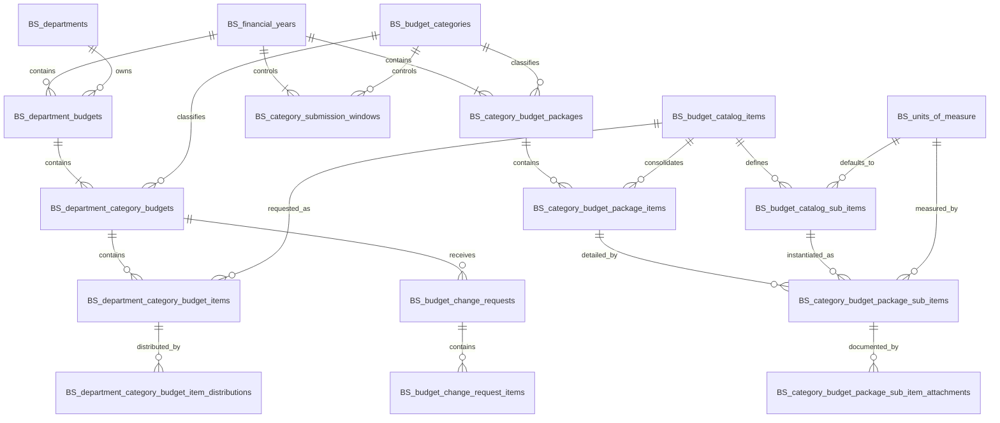

# QNH Budget Planning and Approval Module

## Complete Workflow, Database Design, and Backend Behavior

**Scope:** Financial Year `OPEN` through Financial Year `PRE_CLOSING`  
**Audience:** Database developers, backend developers, frontend developers, reviewers, and future maintainers  
**Status:** Updated target design based on the agreed new workflow  
**Database:** Microsoft SQL Server  
**Application stack:** Node.js / Express / SQL Server / React

---

# 1. Purpose of This Document

This document is the main technical reference for redesigning the QNH Budget Planning and Approval module.

It defines:

- the complete workflow from opening a financial year until moving it to `PRE_CLOSING`;
- the purpose and exact relationship of every table in this module;
- when each record is created;
- what the backend validates before each action;
- what the backend inserts or updates after each action;
- which operations must execute in one SQL transaction;
- which statuses are stored and which values are calculated;
- how HOD users enter and resubmit department budgets;
- how Category Budget Managers review department items;
- how hospital-wide category packages are created;
- when package-item records are created;
- how reusable sub-item master records work;
- how the automatic `General` sub-item works;
- where quantity, unit price, specifications, attachments, and future PO links belong;
- how the CFO reviews or returns a complete category package;
- how a Category Budget Manager returns a specific department budget when HOD input is required;
- how change requests work while the year is still `OPEN`;
- why `PRE_CLOSING` is the final approval of the complete annual budget;
- how workflow history, concurrency, validation, and reporting should work.

This document replaces the earlier proposal that used:

- a separate financial-year budget approval table;
- unnecessary intermediate statuses such as `SUBMITTED` and `UNDER_CATEGORY_REVIEW`;
- attachments directly on package parent items;
- no reusable sub-item catalog.

---

# 2. Final Agreed Business Flow

The new workflow is:

```text
Department User / HOD
→ Category Budget Manager
→ CFO
→ PRE_CLOSING
→ Execution
```

The three budget responsibility categories are:

```text
IT
Biomedical
General
```

Each department receives:

```text
One Department Annual Budget
└── Three Department Category Budgets
    ├── IT
    ├── Biomedical
    └── General
```

Each Category Budget Manager prepares one hospital-wide package:

```text
Financial Year 2027
├── Hospital IT Package
├── Hospital Biomedical Package
└── Hospital General Package
```

The CFO reviews or returns each complete category package.

The CFO does **not** directly return a department budget. The CFO returns the complete category package to its Category Budget Manager. The Category Budget Manager decides whether:

1. the package can be corrected directly; or
2. a specific department category budget must be returned to its HOD.

The return path is:

```text
CFO
→ Category Budget Manager
→ HOD, only when department input is required
→ Category Budget Manager
→ CFO
```

When all three category packages are ready, the CFO moves the financial year:

```text
OPEN
→ PRE_CLOSING
```

That transition is the CFO's final approval of the complete annual hospital budget.

There is no separate whole-year approval table.

---

# 3. Module Boundary

## 3.1 Included

This module includes:

```text
Financial Year OPEN
→ Department Budget Initialization
→ Department Budget Preparation
→ Department Category Submission
→ Category Manager Review
→ Category Submission Cutoff
→ Hospital Category Package Preparation
→ Reusable and Year-Specific Sub-Items
→ Sub-Item Pricing and Attachments
→ CFO Category Package Review
→ Controlled Changes While Year Is OPEN
→ Financial Year PRE_CLOSING
```

## 3.2 Outside This Module

The following activities begin after `PRE_CLOSING` and will be designed separately:

- category budget transfers;
- purchase order linking;
- budget consumption;
- remaining balances;
- execution reporting;
- final financial-year closing.

However, this module defines the sub-item record that the future PO-link module must reference.

---

# 4. Roles and Responsibilities

## 4.1 HOD / Department Budget Manager

The HOD:

- works only in the assigned department;
- sees one complete department budget for the current open financial year;
- sees three category tabs: IT, Biomedical, and General;
- selects generic catalog items;
- enters requested quantities;
- selects a distribution method;
- does not enter unit price;
- does not select a vendor;
- does not define models or detailed technical specifications;
- submits each category independently;
- edits only department items marked `NEEDS_MODIFICATION`;
- cannot modify accepted items directly;
- uses change requests for controlled changes after CFO package completion and before `PRE_CLOSING`.

## 4.2 Department User

A Department User can assist inside the assigned department according to effective permissions.

The scope comes from:

```text
BS_budget_user_roles.department_id
```

The allowed actions come from:

```text
Role permissions
+ user permission grants
- user permission denials
```

## 4.3 Category Budget Manager

A Category Budget Manager:

- is assigned to one budget category;
- sees the assigned category across all departments;
- reviews department items;
- records category-approved quantities;
- accepts items or marks them `NEEDS_MODIFICATION`;
- returns a department category budget when department correction is required;
- sees consolidated hospital demand;
- manages reusable sub-item definitions;
- manages year-specific package sub-items;
- enters package sub-item quantities and unit prices;
- adds specifications and attachments to package sub-items;
- reconciles sub-item quantities with accepted department quantities;
- closes and reopens the category submission window;
- submits the complete hospital-wide category package to CFO;
- handles CFO returns;
- decides whether a CFO return can be fixed at package level or requires HOD input.

The category scope comes from:

```text
BS_budget_user_roles.budget_category_id
```

## 4.4 CFO / Budget Approver

The CFO:

- opens a financial year;
- reviews complete hospital-wide category packages;
- accepts package items or marks them `NEEDS_MODIFICATION`;
- returns a complete category package to the Category Budget Manager;
- may reopen a completed package while the financial year remains `OPEN`;
- does not directly modify department quantities;
- does not directly modify sub-item quantities, prices, or specifications;
- moves the financial year to `PRE_CLOSING` when all conditions are satisfied.

Moving the year to `PRE_CLOSING` is the final approval of the complete annual budget.

## 4.5 Budget System Administrator

The administrator manages:

- departments;
- budget categories;
- generic catalog items;
- reusable sub-item masters;
- units of measure;
- roles;
- permissions;
- role assignments;
- user permission overrides.

---

# 5. Core Design Decisions

## 5.1 Keep `BS_financial_years`

`BS_financial_years` remains the parent of all year-specific workflow data.

It is required because department budgets, category windows, category packages, change requests, transfers, and PO links must belong to a financial year.

## 5.2 Remove the Separate Annual Approval Table

Do not create:

```text
BS_financial_year_budget_approvals
BS_financial_year_budget_approval_packages
```

Reason:

- while the year is `OPEN`, a completed category package may still be returned;
- a separate approval record would become stale when a package is reopened;
- it would require approval rounds and invalidation logic;
- `pre_closed_by` and `pre_closed_at` already record the CFO and time of final approval.

Final meaning:

```text
CFO_REVIEW_COMPLETED
= one category package is accepted but still reopenable while the year is OPEN

PRE_CLOSING
= the complete annual hospital budget is finally approved and planning is locked
```

## 5.3 One Parent Department Budget per Department and Year

There must be exactly one record for:

```text
Financial Year + Department
```

Example:

```text
Laboratory Department Budget — 2027
```

This parent provides one clear ID for loading the department's complete annual budget.

## 5.4 Three Category Budgets under Every Department Budget

Each parent receives exactly three child rows:

```text
IT
Biomedical
General
```

The rows are created automatically when the year opens.

## 5.5 Category Budgets Move Independently

Example:

```text
Laboratory 2027

IT          = CATEGORY_REVIEW_COMPLETED
Biomedical  = RETURNED_TO_DEPARTMENT
General     = DRAFT
```

Therefore, the parent department budget does not store a workflow status. Its overall status is calculated from the three children.

## 5.6 Minimal Stored Statuses

A stored status should exist only when it changes:

- responsibility;
- editability;
- permissions;
- next allowed actions.

Do not store separate statuses only to show that a user opened a page or started reading a record.

## 5.7 Package Items Are Workflow Entities, Not Stored Totals

`BS_category_budget_package_items` exists because it provides a stable parent for:

- year-specific sub-items;
- CFO item decisions;
- reconciliation status;
- review notes;
- workflow history.

Hospital totals are calculated from department items and are not duplicated in the package-item row.

## 5.8 Package Items Are Created Lazily

A package-item row is created only when the first HOD submits that catalog item.

Example:

```text
HOD adds Laptop as draft
→ no package item

First department submits Laptop
→ create one Laptop package item

Second department submits Laptop
→ reuse the same package item
```

## 5.9 Every Catalog Item Has a Reusable General Sub-Item

When a generic catalog item is created, the backend also creates one reusable default sub-item:

```text
General
```

When the corresponding package item is created for a year, the backend automatically creates one year-specific `General` package sub-item.

This guarantees that the Category Budget Manager can prepare and price the package even when no detailed model split is needed.

## 5.10 Price, Attachments, and Future PO Links Belong to Package Sub-Items

The execution hierarchy is:

```text
Generic Catalog Item
→ Reusable Sub-Item Master
→ Year-Specific Package Sub-Item
→ Quantity
→ Unit Price
→ Attachments
→ Future PO Linking
```

Do not attach these directly to the generic package parent item.

## 5.11 Selective Editing after Returns

Returning a header does not unlock all children.

Only rows marked:

```text
NEEDS_MODIFICATION
```

become editable.

Accepted rows remain locked.

## 5.12 Multi-Table Commands Are Transactional

Any backend action that changes several related tables must use one SQL transaction.

Examples:

- open a financial year;
- submit a department category budget;
- create a package item and its General sub-item;
- return a department category budget;
- close or reopen a category window;
- submit or return a package;
- apply a change request;
- move the year to `PRE_CLOSING`.

---

# 6. High-Level Entity Model



---

# 7. Tables Used by This Module

## 7.1 Access-Control Tables Already Approved

```text
BS_budget_roles
BS_budget_permissions
BS_budget_role_permissions
BS_budget_user_roles
BS_budget_user_permission_overrides
```

## 7.2 Master-Data Tables

```text
BS_departments
BS_budget_categories
BS_units_of_measure
BS_budget_catalog_items
BS_budget_catalog_sub_items
```

## 7.3 Planning and Approval Workflow Tables

```text
BS_financial_years
BS_department_budgets
BS_department_category_budgets
BS_department_category_budget_items
BS_department_category_budget_item_distributions
BS_category_submission_windows
BS_category_budget_packages
BS_category_budget_package_items
BS_category_budget_package_sub_items
BS_category_budget_package_sub_item_attachments
BS_budget_change_requests
BS_budget_change_request_items
BS_budget_workflow_history
```

## 7.4 Calculated Views

Recommended views:

```text
VW_category_budget_consolidated_items
VW_category_budget_department_contributions
VW_category_package_financial_summary
VW_department_budget_overall_status
VW_financial_year_pre_closing_readiness
```

There is no physical package-contributions table because department contributions can be calculated from source records.

---

# 8. Final Stored Status Models

## 8.1 Financial Year

```text
OPEN
PRE_CLOSING
CLOSED
```

## 8.2 Department Category Budget Header

```text
DRAFT
IN_CATEGORY_REVIEW
RETURNED_TO_DEPARTMENT
CATEGORY_REVIEW_COMPLETED
```

Flow:

```text
DRAFT
→ HOD submits
→ IN_CATEGORY_REVIEW

IN_CATEGORY_REVIEW
→ RETURNED_TO_DEPARTMENT
→ HOD resubmits
→ IN_CATEGORY_REVIEW

IN_CATEGORY_REVIEW
→ CATEGORY_REVIEW_COMPLETED
```

There is no separate `SUBMITTED` status.

Submission metadata is stored in:

```text
submitted_by
submitted_at
```

## 8.3 Department Category Budget Item

```text
DRAFT
PENDING_CATEGORY_REVIEW
CATEGORY_ACCEPTED
NEEDS_MODIFICATION
```

## 8.4 Category Submission Window

```text
OPEN
CLOSED
```

## 8.5 Category Package Header

```text
DRAFT
IN_CFO_REVIEW
RETURNED_BY_CFO
CFO_REVIEW_COMPLETED
```

Flow:

```text
DRAFT
→ Category Manager submits
→ IN_CFO_REVIEW

IN_CFO_REVIEW
→ RETURNED_BY_CFO
→ Category Manager resubmits
→ IN_CFO_REVIEW

IN_CFO_REVIEW
→ CFO_REVIEW_COMPLETED

CFO_REVIEW_COMPLETED
→ RETURNED_BY_CFO
```

The last transition is allowed only while the financial year is `OPEN`.

## 8.6 Package Item CFO Review

Before CFO submission:

```text
cfo_review_status = NULL
```

During CFO review:

```text
PENDING_CFO_REVIEW
CFO_ACCEPTED
NEEDS_MODIFICATION
```

## 8.7 Derived Display States

The following values are calculated and are not stored as header statuses.

### Department Category: No Requests

```text
header.status = DRAFT
active item count = 0
category window = CLOSED
```

Display:

```text
NO_REQUESTS
```

### Department Category: Missed Cutoff

```text
header.status = DRAFT
active item count > 0
submitted_at IS NULL
category window = CLOSED
```

Display:

```text
NOT_SUBMITTED_AT_CUTOFF
```

### Hospital Category: No Requests

```text
category window = CLOSED
active package item count = 0
no submitted department items exist
```

Display:

```text
NO_REQUESTS
```

The package header can remain `DRAFT`.

---

# 9. Detailed Table Designs

## 9.1 `BS_financial_years`

Purpose:

> Represents one annual budget cycle and its operational lifecycle.

| Column | Type | Null | Notes |
|---|---|---:|---|
| `id` | `INT IDENTITY(1,1)` | No | Primary key |
| `year` | `INT` | No | Unique calendar/financial year |
| `status` | `VARCHAR(20)` | No | `OPEN`, `PRE_CLOSING`, `CLOSED` |
| `opened_by` | `INT` | No | CFO who opened the year |
| `opened_at` | `DATETIME2(3)` | No | Actual opening time |
| `pre_closed_by` | `INT` | Yes | CFO giving final annual approval |
| `pre_closed_at` | `DATETIME2(3)` | Yes | Final approval / planning lock time |
| `closed_by` | `INT` | Yes | CFO who finally closed execution |
| `closed_at` | `DATETIME2(3)` | Yes | Final closing time |
| `updated_by` | `INT` | Yes | Last updater |
| `updated_at` | `DATETIME2(3)` | Yes | Last update |
| `row_version` | `ROWVERSION` | No | Optimistic concurrency |

Constraints:

```text
PK(id)
UNIQUE(year)
CHECK status IN ('OPEN', 'PRE_CLOSING', 'CLOSED')
CHECK pre-closing and closing timestamps match the current status
```

Important:

```text
PRE_CLOSING is the final whole-year budget approval.
```

## 9.2 `BS_department_budgets`

Purpose:

> One complete department annual budget container.

Example:

```text
Laboratory Department Budget — 2027
```

| Column | Type | Null | Notes |
|---|---|---:|---|
| `id` | `BIGINT IDENTITY(1,1)` | No | Primary key |
| `financial_year_id` | `INT` | No | FK to financial year |
| `department_id` | `INT` | No | FK to department |
| `created_by` | `INT` | Yes | CFO/system |
| `created_at` | `DATETIME2(3)` | No | Creation |
| `updated_by` | `INT` | Yes | Last updater |
| `updated_at` | `DATETIME2(3)` | Yes | Last update |
| `row_version` | `ROWVERSION` | No | Concurrency |

Constraints:

```text
PK(id)
FK(financial_year_id) → BS_financial_years.id
FK(department_id) → BS_departments.id
UNIQUE(financial_year_id, department_id)
```

No status is stored. The overall state is derived from its three child category budgets.

## 9.3 `BS_department_category_budgets`

Purpose:

> One IT, Biomedical, or General budget under a department annual budget.

| Column | Type | Null | Notes |
|---|---|---:|---|
| `id` | `BIGINT IDENTITY(1,1)` | No | Primary key |
| `department_budget_id` | `BIGINT` | No | Parent department annual budget |
| `budget_category_id` | `INT` | No | IT, Biomedical, or General |
| `status` | `VARCHAR(40)` | No | Header workflow state |
| `submitted_by` | `INT` | Yes | Latest submitter |
| `submitted_at` | `DATETIME2(3)` | Yes | Latest submission |
| `returned_by` | `INT` | Yes | Category Manager |
| `returned_at` | `DATETIME2(3)` | Yes | Latest return |
| `return_reason` | `NVARCHAR(1000)` | Yes | Header return reason |
| `category_review_completed_by` | `INT` | Yes | Category Manager |
| `category_review_completed_at` | `DATETIME2(3)` | Yes | Completion time |
| `created_by` | `INT` | Yes | Creator/system |
| `created_at` | `DATETIME2(3)` | No | Creation |
| `updated_by` | `INT` | Yes | Last updater |
| `updated_at` | `DATETIME2(3)` | Yes | Last update |
| `row_version` | `ROWVERSION` | No | Concurrency |

Statuses:

```text
DRAFT
IN_CATEGORY_REVIEW
RETURNED_TO_DEPARTMENT
CATEGORY_REVIEW_COMPLETED
```

Constraints:

```text
PK(id)
FK(department_budget_id) → BS_department_budgets.id
FK(budget_category_id) → BS_budget_categories.id
UNIQUE(department_budget_id, budget_category_id)
```

## 9.4 `BS_department_category_budget_items`

Purpose:

> Stores a generic item requested by one department in one category.

| Column | Type | Null | Notes |
|---|---|---:|---|
| `id` | `BIGINT IDENTITY(1,1)` | No | Primary key |
| `department_category_budget_id` | `BIGINT` | No | Parent category budget |
| `catalog_item_id` | `INT` | No | Generic catalog item |
| `requested_quantity` | `DECIMAL(18,4)` | No | HOD-entered quantity |
| `hod_item_note` | `NVARCHAR(3000)` | Yes | Optional HOD item context for Category Manager review |
| `category_approved_quantity` | `DECIMAL(18,4)` | Yes | Category Manager decision |
| `distribution_method` | `VARCHAR(40)` | No | Annual, quarterly, monthly, custom |
| `review_status` | `VARCHAR(40)` | No | Item review state |
| `review_note` | `NVARCHAR(1000)` | Yes | Category Manager note |
| `reviewed_by` | `INT` | Yes | Category Manager |
| `reviewed_at` | `DATETIME2(3)` | Yes | Review time |
| `is_active` | `BIT` | No | Soft-delete flag |
| `created_by` | `INT` | Yes | HOD/Department User |
| `created_at` | `DATETIME2(3)` | No | Creation |
| `updated_by` | `INT` | Yes | Last updater |
| `updated_at` | `DATETIME2(3)` | Yes | Last update |
| `row_version` | `ROWVERSION` | No | Concurrency |

Statuses:

```text
DRAFT
PENDING_CATEGORY_REVIEW
CATEGORY_ACCEPTED
NEEDS_MODIFICATION
```

Constraints:

```text
PK(id)
FK(department_category_budget_id) → BS_department_category_budgets.id
FK(catalog_item_id) → BS_budget_catalog_items.id
UNIQUE(department_category_budget_id, catalog_item_id)
CHECK requested_quantity > 0
CHECK category_approved_quantity IS NULL OR category_approved_quantity >= 0
```

The database should additionally validate through backend logic that the catalog item's category matches the category budget.

## 9.5 `BS_department_category_budget_item_distributions`

Purpose:

> Stores the requested quantity distribution across annual, quarterly, monthly, or custom periods.

| Column | Type | Null | Notes |
|---|---|---:|---|
| `id` | `BIGINT IDENTITY(1,1)` | No | Primary key |
| `department_budget_item_id` | `BIGINT` | No | Parent item |
| `period_type` | `VARCHAR(20)` | No | `YEAR`, `QUARTER`, `MONTH`, `CUSTOM` |
| `period_no` | `INT` | No | Period number |
| `quantity` | `DECIMAL(18,4)` | No | Period quantity |
| `created_at` | `DATETIME2(3)` | No | Creation |
| `updated_at` | `DATETIME2(3)` | Yes | Last update |

Constraints:

```text
FK(department_budget_item_id) → BS_department_category_budget_items.id
UNIQUE(department_budget_item_id, period_type, period_no)
CHECK quantity >= 0
```

Backend rule:

```text
SUM(distribution quantities) = requested_quantity
```

## 9.6 `BS_category_submission_windows`

Purpose:

> Controls whether departments may submit one category in one financial year.

| Column | Type | Null | Notes |
|---|---|---:|---|
| `id` | `BIGINT IDENTITY(1,1)` | No | Primary key |
| `financial_year_id` | `INT` | No | Financial year |
| `budget_category_id` | `INT` | No | Category |
| `status` | `VARCHAR(20)` | No | `OPEN` or `CLOSED` |
| `closed_by` | `INT` | Yes | Category Manager |
| `closed_at` | `DATETIME2(3)` | Yes | Latest close |
| `close_reason` | `NVARCHAR(1000)` | Yes | Reason |
| `reopened_by` | `INT` | Yes | Category Manager |
| `reopened_at` | `DATETIME2(3)` | Yes | Latest reopen |
| `reopen_reason` | `NVARCHAR(1000)` | Yes | Reason |
| `created_at` | `DATETIME2(3)` | No | Creation |
| `updated_at` | `DATETIME2(3)` | Yes | Update |
| `row_version` | `ROWVERSION` | No | Concurrency |

Constraints:

```text
UNIQUE(financial_year_id, budget_category_id)
CHECK status IN ('OPEN', 'CLOSED')
```

## 9.7 `BS_category_budget_packages`

Purpose:

> One hospital-wide IT, Biomedical, or General package for a financial year.

Example:

```text
2027 Hospital IT Package
```

| Column | Type | Null | Notes |
|---|---|---:|---|
| `id` | `BIGINT IDENTITY(1,1)` | No | Primary key |
| `financial_year_id` | `INT` | No | Year |
| `budget_category_id` | `INT` | No | Category |
| `status` | `VARCHAR(40)` | No | Package state |
| `submitted_to_cfo_by` | `INT` | Yes | Category Manager |
| `submitted_to_cfo_at` | `DATETIME2(3)` | Yes | Latest submission |
| `returned_by_cfo` | `INT` | Yes | CFO |
| `returned_at` | `DATETIME2(3)` | Yes | Latest return |
| `return_reason` | `NVARCHAR(1000)` | Yes | Package-level reason |
| `cfo_review_completed_by` | `INT` | Yes | CFO |
| `cfo_review_completed_at` | `DATETIME2(3)` | Yes | Completion |
| `created_by` | `INT` | Yes | CFO/system |
| `created_at` | `DATETIME2(3)` | No | Creation |
| `updated_by` | `INT` | Yes | Last updater |
| `updated_at` | `DATETIME2(3)` | Yes | Update |
| `row_version` | `ROWVERSION` | No | Concurrency |

Statuses:

```text
DRAFT
IN_CFO_REVIEW
RETURNED_BY_CFO
CFO_REVIEW_COMPLETED
```

Constraints:

```text
FK(financial_year_id) → BS_financial_years.id
FK(budget_category_id) → BS_budget_categories.id
UNIQUE(financial_year_id, budget_category_id)
```

## 9.8 `BS_category_budget_package_items`

Purpose:

> Stable year/category/catalog-item workflow record used to attach package sub-items and CFO decisions.

It does not store duplicated hospital totals.

| Column | Type | Null | Notes |
|---|---|---:|---|
| `id` | `BIGINT IDENTITY(1,1)` | No | Primary key |
| `category_budget_package_id` | `BIGINT` | No | Package |
| `catalog_item_id` | `INT` | No | Generic item |
| `cfo_review_status` | `VARCHAR(40)` | Yes | Null before CFO submission |
| `cfo_review_note` | `NVARCHAR(1000)` | Yes | CFO note |
| `cfo_reviewed_by` | `INT` | Yes | CFO |
| `cfo_reviewed_at` | `DATETIME2(3)` | Yes | Review time |
| `needs_reconciliation` | `BIT` | No | Source quantities/details changed |
| `is_active` | `BIT` | No | Soft state |
| `created_by` | `INT` | Yes | System/current submitter |
| `created_at` | `DATETIME2(3)` | No | Creation |
| `updated_by` | `INT` | Yes | Last updater |
| `updated_at` | `DATETIME2(3)` | Yes | Update |
| `row_version` | `ROWVERSION` | No | Concurrency |

CFO statuses:

```text
NULL
PENDING_CFO_REVIEW
CFO_ACCEPTED
NEEDS_MODIFICATION
```

Constraints:

```text
FK(category_budget_package_id) → BS_category_budget_packages.id
FK(catalog_item_id) → BS_budget_catalog_items.id
UNIQUE(category_budget_package_id, catalog_item_id)
```

Initial creation values:

```text
cfo_review_status = NULL
needs_reconciliation = 1
is_active = 1
```

## 9.9 `BS_budget_catalog_sub_items`

Purpose:

> Reusable sub-item/model/specification master that can be reused across financial years.

Example:

```text
Generic Item: Computers & Laptops

Reusable Sub-Items:
- General
- Dell Latitude 5450
- HP EliteBook 840
```

| Column | Type | Null | Notes |
|---|---|---:|---|
| `id` | `INT IDENTITY(1,1)` | No | Primary key |
| `catalog_item_id` | `INT` | No | Generic parent item |
| `sub_item_code` | `VARCHAR(100)` | No | Stable technical code |
| `name` | `NVARCHAR(300)` | No | Display name |
| `default_specification` | `NVARCHAR(2000)` | Yes | Reusable template |
| `default_unit_of_measure_id` | `INT` | No | Default unit |
| `is_default_general` | `BIT` | No | Identifies fallback sub-item |
| `is_active` | `BIT` | No | Active master |
| `created_by` | `INT` | Yes | Creator |
| `created_at` | `DATETIME2(3)` | No | Creation |
| `updated_by` | `INT` | Yes | Last updater |
| `updated_at` | `DATETIME2(3)` | Yes | Update |
| `row_version` | `ROWVERSION` | No | Concurrency |

Constraints:

```text
FK(catalog_item_id) → BS_budget_catalog_items.id
FK(default_unit_of_measure_id) → BS_units_of_measure.id
UNIQUE(catalog_item_id, sub_item_code)
UNIQUE(catalog_item_id, name)
```

Recommended filtered unique index:

```text
Only one active is_default_general = 1 row per catalog_item_id
```

Do not store year-specific quantity, unit price, attachments, supplier, or PO data in this master.

## 9.10 `BS_category_budget_package_sub_items`

Purpose:

> Year-specific detailed specification and priced execution record inside one package item.

This is the record targeted by future PO linking.

| Column | Type | Null | Notes |
|---|---|---:|---|
| `id` | `BIGINT IDENTITY(1,1)` | No | Primary key |
| `category_budget_package_item_id` | `BIGINT` | No | Parent package item |
| `catalog_sub_item_id` | `INT` | No | Reusable master |
| `name` | `NVARCHAR(300)` | No | Year-specific snapshot |
| `specification` | `NVARCHAR(2000)` | Yes | Year-specific snapshot |
| `unit_of_measure_id` | `INT` | No | Year-specific unit |
| `quantity` | `DECIMAL(18,4)` | Yes | Null until prepared |
| `unit_price` | `DECIMAL(18,6)` | Yes | Null until prepared |
| `note` | `NVARCHAR(1000)` | Yes | Manager note |
| `is_active` | `BIT` | No | Soft delete |
| `created_by` | `INT` | Yes | Manager/system |
| `created_at` | `DATETIME2(3)` | No | Creation |
| `updated_by` | `INT` | Yes | Last updater |
| `updated_at` | `DATETIME2(3)` | Yes | Update |
| `row_version` | `ROWVERSION` | No | Concurrency |

Constraints:

```text
FK(category_budget_package_item_id) → BS_category_budget_package_items.id
FK(catalog_sub_item_id) → BS_budget_catalog_sub_items.id
FK(unit_of_measure_id) → BS_units_of_measure.id
UNIQUE(category_budget_package_item_id, catalog_sub_item_id)
CHECK quantity IS NULL OR quantity >= 0
CHECK unit_price IS NULL OR unit_price >= 0
```

The copied `name`, `specification`, and `unit_of_measure_id` preserve the exact year-specific values even if the reusable master changes later.

Calculated amount:

```text
quantity × unit_price
```

## 9.11 `BS_category_budget_package_sub_item_attachments`

Purpose:

> Stores quotations, specifications, comparisons, and other documents for one year-specific package sub-item.

| Column | Type | Null | Notes |
|---|---|---:|---|
| `id` | `BIGINT IDENTITY(1,1)` | No | Primary key |
| `category_budget_package_sub_item_id` | `BIGINT` | No | Parent sub-item |
| `document_type` | `VARCHAR(50)` | Yes | Quotation, specification, comparison, etc. |
| `original_file_name` | `NVARCHAR(300)` | No | Original file name |
| `storage_key` | `NVARCHAR(500)` | No | Storage reference |
| `mime_type` | `NVARCHAR(150)` | Yes | MIME type |
| `file_size_bytes` | `BIGINT` | No | File size |
| `description` | `NVARCHAR(500)` | Yes | Description |
| `is_active` | `BIT` | No | Active attachment |
| `uploaded_by` | `INT` | No | Uploader |
| `uploaded_at` | `DATETIME2(3)` | No | Upload time |
| `disabled_by` | `INT` | Yes | Removal user |
| `disabled_at` | `DATETIME2(3)` | Yes | Removal time |
| `disabled_reason` | `NVARCHAR(500)` | Yes | Reason |

Constraint:

```text
FK(category_budget_package_sub_item_id)
→ BS_category_budget_package_sub_items.id
```

If one document applies to the entire parent item, attach it to the `General` package sub-item.

## 9.12 `BS_budget_change_requests`

Purpose:

> Header for a controlled HOD request to change an already completed budget while the year is still `OPEN`.

| Column | Type | Null | Notes |
|---|---|---:|---|
| `id` | `BIGINT IDENTITY(1,1)` | No | Primary key |
| `department_category_budget_id` | `BIGINT` | No | Affected department category |
| `status` | `VARCHAR(40)` | No | Change-request workflow |
| `reason` | `NVARCHAR(2000)` | No | Overall justification |
| `submitted_by` | `INT` | Yes | HOD |
| `submitted_at` | `DATETIME2(3)` | Yes | Submission |
| `category_reviewed_by` | `INT` | Yes | Category Manager |
| `category_reviewed_at` | `DATETIME2(3)` | Yes | Category review |
| `category_note` | `NVARCHAR(1000)` | Yes | Category note |
| `cfo_reviewed_by` | `INT` | Yes | CFO |
| `cfo_reviewed_at` | `DATETIME2(3)` | Yes | CFO review |
| `cfo_note` | `NVARCHAR(1000)` | Yes | CFO note |
| `applied_by` | `INT` | Yes | Applier |
| `applied_at` | `DATETIME2(3)` | Yes | Apply time |
| `created_by` | `INT` | No | Creator |
| `created_at` | `DATETIME2(3)` | No | Creation |
| `updated_by` | `INT` | Yes | Updater |
| `updated_at` | `DATETIME2(3)` | Yes | Update |
| `row_version` | `ROWVERSION` | No | Concurrency |

Statuses:

```text
DRAFT
IN_CATEGORY_REVIEW
RETURNED_BY_CATEGORY
IN_CFO_REVIEW
RETURNED_BY_CFO
APPROVED
REJECTED
APPLIED
CANCELLED
```

## 9.13 `BS_budget_change_request_items`

Purpose:

> Stores each requested modification inside one change request.

| Column | Type | Null | Notes |
|---|---|---:|---|
| `id` | `BIGINT IDENTITY(1,1)` | No | Primary key |
| `change_request_id` | `BIGINT` | No | Parent |
| `change_type` | `VARCHAR(40)` | No | Requested action |
| `existing_department_budget_item_id` | `BIGINT` | Yes | Existing item |
| `catalog_item_id` | `INT` | No | Target generic item |
| `current_requested_quantity` | `DECIMAL(18,4)` | Yes | Snapshot |
| `proposed_requested_quantity` | `DECIMAL(18,4)` | No | Proposed value |
| `proposed_distribution_method` | `VARCHAR(40)` | Yes | Proposed method |
| `description` | `NVARCHAR(1000)` | Yes | Item reason |
| `category_review_status` | `VARCHAR(40)` | No | Category decision |
| `category_review_note` | `NVARCHAR(1000)` | Yes | Note |
| `cfo_review_status` | `VARCHAR(40)` | No | CFO decision |
| `cfo_review_note` | `NVARCHAR(1000)` | Yes | Note |
| `created_at` | `DATETIME2(3)` | No | Creation |
| `updated_at` | `DATETIME2(3)` | Yes | Update |

Change types:

```text
ADD_ITEM
INCREASE_QUANTITY
DECREASE_QUANTITY
MODIFY_ITEM
```

## 9.14 `BS_budget_workflow_history`

Purpose:

> Append-only business-readable timeline of important workflow actions.

| Column | Type | Null | Notes |
|---|---|---:|---|
| `id` | `BIGINT IDENTITY(1,1)` | No | Primary key |
| `financial_year_id` | `INT` | Yes | Year context |
| `entity_type` | `VARCHAR(80)` | No | Record type |
| `entity_id` | `BIGINT` | No | Record ID |
| `action` | `VARCHAR(100)` | No | Business event |
| `old_status` | `VARCHAR(50)` | Yes | Previous status |
| `new_status` | `VARCHAR(50)` | Yes | New status |
| `note` | `NVARCHAR(1000)` | Yes | Human-readable explanation |
| `old_values_json` | `NVARCHAR(MAX)` | Yes | Optional previous details |
| `new_values_json` | `NVARCHAR(MAX)` | Yes | Optional new details |
| `user_role_id` | `INT` | Yes | Acting role assignment |
| `acting_workspace` | `VARCHAR(80)` | Yes | Department, category, CFO, etc. |
| `correlation_id` | `UNIQUEIDENTIFIER` | Yes | Groups events from one command |
| `created_by` | `INT` | No | Actor |
| `created_at` | `DATETIME2(3)` | No | Event time |

This table should normally allow inserts only.

---

# 10. Automatic General Sub-Item Rules

## 10.1 When a Generic Catalog Item Is Created

Example:

```text
Computers & Laptops
```

The backend transaction creates:

1. `BS_budget_catalog_items` row;
2. one `BS_budget_catalog_sub_items` row:

```text
sub_item_code = GENERAL
name = General
is_default_general = 1
```

If either insert fails, both must roll back.

## 10.2 When a Package Item Is First Created

Example:

```text
2027 IT Package
→ Computers & Laptops
```

The backend transaction:

1. inserts the package item;
2. finds the reusable General sub-item;
3. inserts one year-specific General package sub-item;
4. copies:
   - name;
   - default specification;
   - default unit;
5. leaves:
   - quantity = NULL;
   - unit_price = NULL.

## 10.3 General Sub-Item Usage

### No Detailed Model Split

```text
General
Quantity = 50
Unit Price = 4,500
```

### Partial Detailed Split

```text
Dell Latitude 5450 = 30
HP EliteBook 840 = 15
General = 5
```

### Fully Detailed Split

```text
Dell Latitude 5450 = 30
HP EliteBook 840 = 20
General = 0
```

The General sub-item remains available for shared documents.

---

# 11. Exact Backend and Database Workflow

## 11.1 CFO Opens a Financial Year

### User Action

CFO creates Financial Year 2027.

### Backend Validations

1. User has financial-year lifecycle permission.
2. No year exists with `year = 2027`.
3. No other year is `OPEN` or `PRE_CLOSING`.
4. IT, Biomedical, and General categories exist and are active.
5. Active departments exist.
6. Every active generic catalog item has one active General reusable sub-item.

### One Database Transaction

#### A. Insert Financial Year

```text
year = 2027
status = OPEN
opened_by = CFO
opened_at = current UTC time
```

#### B. Create Department Parent Budgets

For each active department:

```text
INSERT BS_department_budgets
```

With 30 departments:

```text
30 parent rows
```

#### C. Create Three Category Budgets under Every Parent

For each department parent:

```text
IT
Biomedical
General
```

With 30 departments:

```text
90 child rows
status = DRAFT
```

#### D. Create Three Submission Windows

```text
2027 + IT + OPEN
2027 + Biomedical + OPEN
2027 + General + OPEN
```

#### E. Create Three Package Headers

```text
2027 + IT + DRAFT
2027 + Biomedical + DRAFT
2027 + General + DRAFT
```

No package-item rows are created yet.

#### F. Insert Workflow History and Notification Outbox Rows

Example events:

```text
FINANCIAL_YEAR_OPENED
DEPARTMENT_BUDGETS_INITIALIZED
CATEGORY_WINDOWS_INITIALIZED
CATEGORY_PACKAGES_INITIALIZED
```

### Commit or Rollback

The year must never be partially initialized.

---

## 11.2 HOD Loads the Complete Department Budget

The backend resolves:

```text
active user-role assignment
→ department_id
→ open financial year
→ BS_department_budgets
→ three BS_department_category_budgets
→ items and distributions
```

Example API result:

```json
{
  "departmentBudgetId": 517,
  "financialYear": 2027,
  "department": "Laboratory",
  "overallStatus": "IN_PROGRESS",
  "categories": [
    {
      "category": "IT",
      "status": "DRAFT",
      "derivedDisplayState": null,
      "items": []
    },
    {
      "category": "Biomedical",
      "status": "DRAFT",
      "derivedDisplayState": null,
      "items": []
    },
    {
      "category": "General",
      "status": "DRAFT",
      "derivedDisplayState": null,
      "items": []
    }
  ]
}
```

`overallStatus` is calculated.

---

## 11.3 HOD Adds a Draft Item

Example:

```text
Category: IT
Item: Computers & Laptops
Requested Quantity: 10
Distribution: Quarterly
```

### Validations

- financial year is `OPEN`;
- IT window is `OPEN`;
- user is assigned to the department;
- category header is `DRAFT`;
- catalog item belongs to IT;
- catalog item is active;
- no duplicate active item exists;
- quantity is positive;
- distribution is valid.

### Transaction

1. insert department category budget item with `review_status = DRAFT`;
2. insert distribution rows;
3. verify distribution sum;
4. insert workflow history.

### Package Effect

None.

Draft items do not create package items.

---

## 11.4 HOD Updates or Deletes a Draft Item

### Editable Conditions

```text
header = DRAFT
item = DRAFT
```

or:

```text
header = RETURNED_TO_DEPARTMENT
item = NEEDS_MODIFICATION
```

### Deletion

Before first submission:

- hard delete may be allowed.

After first submission:

- set `is_active = 0`;
- preserve history;
- mark the related package item `needs_reconciliation = 1`.

---

## 11.5 HOD Submits a Department Category Budget

Example:

```text
Laboratory submits IT budget
```

### Validations

- year is `OPEN`;
- category window is `OPEN`;
- header is `DRAFT` or `RETURNED_TO_DEPARTMENT`;
- at least one active item exists;
- every editable item is complete;
- quantities are valid;
- distributions reconcile;
- user belongs to the department.

### One Transaction

#### A. Update Item Review States

First submission:

```text
DRAFT → PENDING_CATEGORY_REVIEW
```

Resubmission:

```text
NEEDS_MODIFICATION → PENDING_CATEGORY_REVIEW
```

Previously accepted items remain:

```text
CATEGORY_ACCEPTED
```

#### B. Update Header

```text
status = IN_CATEGORY_REVIEW
submitted_by = current user
submitted_at = now
```

There is no intermediate `SUBMITTED` status.

#### C. Ensure Package Items Exist

For every distinct submitted catalog item:

1. locate the package by financial year and category;
2. locate the package item by package and catalog item;
3. if missing, create it;
4. if existing, reuse it;
5. set `needs_reconciliation = 1`;
6. set `is_active = 1`.

#### D. Create General Package Sub-Item When Package Item Is New

If the package item was inserted:

1. find the active reusable General sub-item;
2. insert one year-specific package sub-item;
3. copy its name, specification, and unit;
4. leave quantity and unit price null.

#### E. History and Notifications

Insert:

```text
DEPARTMENT_CATEGORY_SUBMITTED
PACKAGE_ITEM_CREATED, when applicable
GENERAL_PACKAGE_SUB_ITEM_CREATED, when applicable
```

Queue Category Manager notifications.

---

## 11.6 Two Departments Submit the Same Generic Item

Example:

```text
Laboratory submits Laptop
Radiology submits Laptop
```

The second submission:

- does not create a second package item;
- does not create a second General package sub-item;
- reuses the existing package item;
- sets `needs_reconciliation = 1`.

The unique constraint protects concurrent submissions.

---

## 11.7 Category Manager Reviews a Department Item

The header is already:

```text
IN_CATEGORY_REVIEW
```

No separate “start review” transition is needed.

### Accept

Example:

```text
Requested = 10
Category Approved = 8
```

Update:

```text
review_status = CATEGORY_ACCEPTED
category_approved_quantity = 8
reviewed_by = manager
reviewed_at = now
```

### Needs Modification

Update:

```text
review_status = NEEDS_MODIFICATION
review_note = required
reviewed_by = manager
reviewed_at = now
```

The related package item remains:

```text
needs_reconciliation = 1
```

---

## 11.8 Category Manager Returns the Department Category Budget

### Validations

- header is `IN_CATEGORY_REVIEW`;
- at least one item is `NEEDS_MODIFICATION`;
- every active item has a decision;
- no item remains `PENDING_CATEGORY_REVIEW`.

### Transaction

```text
header:
IN_CATEGORY_REVIEW → RETURNED_TO_DEPARTMENT
```

Update return metadata.

Accepted items remain locked.

Only `NEEDS_MODIFICATION` items are editable.

Notify HOD.

---

## 11.9 HOD Corrects and Resubmits

The backend allows edits only where:

```text
header = RETURNED_TO_DEPARTMENT
item = NEEDS_MODIFICATION
```

After changes:

```text
related package item.needs_reconciliation = 1
```

On resubmission:

```text
header:
RETURNED_TO_DEPARTMENT → IN_CATEGORY_REVIEW

items:
NEEDS_MODIFICATION → PENDING_CATEGORY_REVIEW
```

Accepted items remain unchanged.

---

## 11.10 Category Manager Completes Department Review

Allowed only when every active item is:

```text
CATEGORY_ACCEPTED
```

Update:

```text
header.status = CATEGORY_REVIEW_COMPLETED
category_review_completed_by = manager
category_review_completed_at = now
```

---

## 11.11 Consolidated Category View

The Category Manager sees:

### Department View

```text
Laboratory
- Laptop: requested 10, approved 8

Radiology
- Laptop: requested 15, approved 15
```

### Consolidated View

```text
Laptop
Total Requested = 25
Total Category Approved = 23
```

Totals are calculated through joins and `SUM()`.

No physical contribution table is required.

For final package readiness, the approved total includes active department items with:

```text
review_status = CATEGORY_ACCEPTED
```

---

## 11.12 Category Manager Uses Reusable Sub-Items

For package item:

```text
Computers & Laptops
```

The Category Manager can:

- keep `General`;
- select an existing reusable sub-item;
- create a new reusable sub-item and immediately instantiate it for the year;
- deactivate a year-specific package sub-item;
- update the year-specific specification without changing the reusable master.

Example:

```text
Dell Latitude 5450 = 15
HP EliteBook 840 = 10
General = 2
```

---

## 11.13 Package Reconciliation

The backend calculates:

```text
Accepted Department Total
=
SUM(category_approved_quantity for accepted active department items)
```

It also calculates:

```text
Package Sub-Item Total
=
SUM(quantity for active package sub-items)
```

The package item is reconciled only when:

```text
Package Sub-Item Total = Accepted Department Total
```

and every active sub-item with quantity greater than zero has:

- unit of measure;
- unit price;
- valid name;
- valid specification when required.

Then:

```text
needs_reconciliation = 0
```

Otherwise:

```text
needs_reconciliation = 1
```

---

## 11.14 Category Manager Uploads Attachments

Attachments must reference:

```text
BS_category_budget_package_sub_items.id
```

Examples:

- Dell quotation → Dell sub-item;
- HP specification → HP sub-item;
- parent-wide document → General sub-item.

A previously submitted attachment should be disabled rather than hard-deleted.

---

## 11.15 Category Manager Closes a Submission Window

Purpose:

> Stop new department submissions for one category so the package population becomes stable.

### Validations

- year is `OPEN`;
- window is `OPEN`;
- user owns the category;
- close reason is provided when required.

### Effects

```text
window.status = CLOSED
```

Do not rewrite department category header statuses.

Derived states are calculated:

```text
DRAFT + zero items
→ display NO_REQUESTS

DRAFT + active items + never submitted
→ display NOT_SUBMITTED_AT_CUTOFF
```

Already submitted/reviewed budgets continue in the workflow.

Closing IT does not close Biomedical or General.

---

## 11.16 Reopen a Submission Window

Allowed only while the year is `OPEN`.

Required:

```text
reopen_reason
```

The window may be reopened when:

- late department submission is accepted;
- Category Manager needs department input after CFO return;
- a controlled change requires department correction.

Any changed source quantity sets:

```text
package_item.needs_reconciliation = 1
```

---

## 11.17 Category Manager Submits the Package to CFO

### Validations

- financial year is `OPEN`;
- category window is `CLOSED`;
- package is `DRAFT` or `RETURNED_BY_CFO`;
- at least one active package item exists, unless derived no-requests applies;
- no included department item is pending or needs modification;
- every active package item has `needs_reconciliation = 0`;
- active package sub-item quantities reconcile;
- prices are present;
- required attachments exist;
- there are no unresolved department returns for included records.

### Transaction

#### Header

```text
DRAFT or RETURNED_BY_CFO
→ IN_CFO_REVIEW
```

Update submission metadata.

#### Package Items

First submission:

```text
NULL → PENDING_CFO_REVIEW
```

Resubmission:

```text
NEEDS_MODIFICATION → PENDING_CFO_REVIEW
```

Previously accepted items remain:

```text
CFO_ACCEPTED
```

Record history and notify CFO.

---

## 11.18 CFO Reviews Package Items

### Accept

```text
PENDING_CFO_REVIEW → CFO_ACCEPTED
```

Store reviewer and time.

### Needs Modification

```text
PENDING_CFO_REVIEW → NEEDS_MODIFICATION
```

A review note is required.

The CFO cannot directly edit package content.

---

## 11.19 CFO Returns the Complete Category Package

### Validations

- package is `IN_CFO_REVIEW` or `CFO_REVIEW_COMPLETED`;
- at least one item is `NEEDS_MODIFICATION`;
- no active package item remains `PENDING_CFO_REVIEW`.

### Transaction

```text
package.status = RETURNED_BY_CFO
```

Accepted package items remain locked.

Only package items marked `NEEDS_MODIFICATION` become editable.

The CFO returns the complete package, not a department budget.

---

# 12. CFO Return Cases

## 12.1 Package-Level Correction Only

Examples:

- wrong unit price;
- missing quotation;
- incorrect technical specification;
- wrong sub-item split;
- attachment missing;
- package sub-item quantity mismatch.

The Category Manager updates only:

- affected package sub-items;
- affected package sub-item attachments;
- affected package item reconciliation.

No department record changes.

After correction:

```text
needs_reconciliation = 0
```

Then the package is resubmitted.

## 12.2 Department Input Is Required

Examples:

- department quantity is unclear;
- wrong generic item was selected;
- business need must change;
- distribution is incorrect.

The Category Manager transaction:

1. keeps package `RETURNED_BY_CFO`;
2. keeps affected package item `NEEDS_MODIFICATION`;
3. sets `needs_reconciliation = 1`;
4. reopens the category window when necessary;
5. marks the affected department item `NEEDS_MODIFICATION`;
6. changes its header to `RETURNED_TO_DEPARTMENT`;
7. records the reason;
8. notifies HOD.

The HOD edits only the affected department item.

After HOD resubmission and Category Manager acceptance:

- totals recalculate;
- package sub-items are reconciled;
- affected package item returns to CFO review.

## 12.3 No Source Department Item Remains

If no active submitted source remains for a package item:

```text
package_item.is_active = 0
package_item.needs_reconciliation = 1
```

Do not hard-delete package items, sub-items, attachments, or history after they have entered workflow.

If the item becomes relevant again:

```text
is_active = 1
cfo_review_status = NULL
needs_reconciliation = 1
```

---

# 13. Completing and Reopening Category Package Review

## 13.1 Complete Review

When every active package item is:

```text
CFO_ACCEPTED
```

update:

```text
package.status = CFO_REVIEW_COMPLETED
cfo_review_completed_by = CFO
cfo_review_completed_at = now
```

## 13.2 Reopen before PRE_CLOSING

While the financial year remains `OPEN`, CFO may return a completed package:

```text
CFO_REVIEW_COMPLETED → RETURNED_BY_CFO
```

The CFO must select affected package items and mark them `NEEDS_MODIFICATION`.

This immediately blocks `PRE_CLOSING`.

After `PRE_CLOSING`, this transition is not allowed.

---

# 14. Change Request Workflow While Year Is OPEN

## 14.1 When a Change Request Is Needed

A direct edit is not allowed after an affected package item has been accepted by CFO.

The HOD creates a change request for:

- add item;
- increase quantity;
- decrease quantity;
- modify item;
- modify distribution.

## 14.2 Eligibility

A change request is allowed only when:

- financial year is `OPEN`;
- affected department category was previously reviewed;
- affected category package is `CFO_REVIEW_COMPLETED`;
- user has department permission;
- no conflicting open request exists.

No separate annual approval record is required.

## 14.3 Review

The change request moves:

```text
DRAFT
→ IN_CATEGORY_REVIEW
→ IN_CFO_REVIEW
→ APPROVED / REJECTED / RETURNED
```

Returned change requests are edited as change-request records, not as approved budget records.

## 14.4 Apply an Approved Change

One transaction:

1. update or create the affected department item;
2. set its review status to `PENDING_CATEGORY_REVIEW`;
3. set department category header to `IN_CATEGORY_REVIEW`;
4. ensure package item and General package sub-item exist for a new generic item;
5. set affected package item:
   - `needs_reconciliation = 1`;
   - `cfo_review_status = NEEDS_MODIFICATION`;
6. set category package:
   - `CFO_REVIEW_COMPLETED → RETURNED_BY_CFO`;
7. mark change request `APPLIED`;
8. insert workflow history;
9. notify users.

Unaffected department and package items remain accepted and locked.

After the affected flow completes, the package returns to:

```text
CFO_REVIEW_COMPLETED
```

There is no annual-approval invalidation table.

---

# 15. CFO Moves the Year to PRE_CLOSING

This is the final whole-year budget approval.

## 15.1 Eligibility

The backend must revalidate all conditions inside the final transaction.

### Financial Year

```text
status = OPEN
```

### Category Windows

All three windows are:

```text
CLOSED
```

### Category Packages

For each category, either:

```text
package.status = CFO_REVIEW_COMPLETED
```

or the category has a derived no-requests condition:

```text
window = CLOSED
no submitted department items
no active package items
package remains DRAFT
```

### Department Category Budgets

None may be:

```text
IN_CATEGORY_REVIEW
RETURNED_TO_DEPARTMENT
```

A `DRAFT` header is acceptable only when it is a derived:

```text
NO_REQUESTS
or
NOT_SUBMITTED_AT_CUTOFF
```

### Department Items

No active item may be:

```text
PENDING_CATEGORY_REVIEW
NEEDS_MODIFICATION
```

### Package Items

No active item may be:

```text
PENDING_CFO_REVIEW
NEEDS_MODIFICATION
```

No active package item may have:

```text
needs_reconciliation = 1
```

### Change Requests

No open change request may exist.

## 15.2 Transaction

```text
BS_financial_years.status = PRE_CLOSING
pre_closed_by = CFO
pre_closed_at = now
updated_by = CFO
updated_at = now
```

Insert workflow history:

```text
FINANCIAL_YEAR_PRE_CLOSED
```

Queue notifications.

## 15.3 Result

After commit:

- normal department editing stops;
- category windows cannot reopen;
- category packages cannot be returned;
- new change requests stop;
- transfer and PO execution modules may begin.

---

# 16. Future PO-Linking Relationship

The future PO-link table must reference:

```text
BS_category_budget_package_sub_items.id
```

Example:

```text
2027 IT Package
→ Computers & Laptops
→ Dell Latitude 5450
→ PO line
```

It must not reference only the parent generic package item because:

- approved quantity is sub-item specific;
- unit price is sub-item specific;
- attachments are sub-item specific;
- model/specification is sub-item specific;
- remaining executable quantity is sub-item specific.

---

# 17. Calculated Values and Views

## 17.1 Department Parent Overall Status

Calculated from three category children.

Possible API display values:

```text
NOT_STARTED
IN_PROGRESS
RETURNED
PARTIALLY_COMPLETED
ALL_CATEGORIES_COMPLETED
```

Do not store this on `BS_department_budgets`.

## 17.2 Consolidated Requested Quantity

```text
SUM(requested_quantity)
```

Group by:

```text
financial_year
category
catalog item
```

## 17.3 Consolidated Category-Approved Quantity

```text
SUM(category_approved_quantity)
```

Include only active accepted department items.

## 17.4 Department Contributions

Calculated by joining:

```text
package
→ package item
→ financial year/category/catalog item
→ department category budget items
→ department budget
→ department
```

## 17.5 Package Sub-Item Total Quantity

```text
SUM(active package sub-item quantity)
```

## 17.6 Package Item Amount

```text
SUM(quantity × unit_price)
```

## 17.7 Category Package Amount

```text
SUM(all active package sub-item amounts)
```

## 17.8 Derived No-Request and Missed-Cutoff States

Calculated from:

- category window status;
- department category header status;
- active item count;
- submitted timestamp.

---

# 18. Backend Architecture

## 18.1 Controllers

Controllers should:

- parse request input;
- resolve authenticated user;
- resolve active `user_role_id` / workspace;
- call one service;
- return service output;
- avoid workflow business rules.

## 18.2 Services

Services should:

- validate permission and scope;
- validate current status;
- start transactions;
- call repositories;
- update all affected entities atomically;
- write workflow history;
- write notification outbox rows;
- return domain-specific errors.

## 18.3 Repositories

Repositories should:

- execute SQL only;
- accept an optional transaction;
- avoid business decisions;
- return records and affected-row counts.

## 18.4 Recommended Services

```text
openFinancialYearService
getDepartmentBudgetService
saveDepartmentBudgetItemService
deleteDepartmentBudgetItemService
submitDepartmentCategoryBudgetService
reviewDepartmentBudgetItemService
returnDepartmentCategoryBudgetService
completeDepartmentCategoryReviewService

closeCategorySubmissionWindowService
reopenCategorySubmissionWindowService

createCatalogSubItemService
updateCatalogSubItemService
savePackageSubItemService
disablePackageSubItemService
uploadPackageSubItemAttachmentService
disablePackageSubItemAttachmentService
reconcilePackageItemService

submitCategoryPackageToCfoService
reviewPackageItemService
returnCategoryPackageService
completeCategoryPackageReviewService
reopenCompletedCategoryPackageService

createBudgetChangeRequestService
submitBudgetChangeRequestService
reviewBudgetChangeRequestByCategoryService
reviewBudgetChangeRequestByCfoService
applyApprovedBudgetChangeRequestService

moveFinancialYearToPreClosingService
```

Removed services:

```text
approveFinancialYearBudgetService
startCategoryReviewService
startCfoPackageReviewService
uploadPackageItemAttachmentService
```

---

# 19. Recommended API Actions

```text
POST   /api/financial-years
POST   /api/financial-years/:id/pre-close

GET    /api/department-budgets/current
GET    /api/department-budgets/:id

POST   /api/department-category-budgets/:id/items
PATCH  /api/department-category-budget-items/:id
DELETE /api/department-category-budget-items/:id
POST   /api/department-category-budgets/:id/submit

GET    /api/category-management/:categoryId/departments
GET    /api/category-management/:categoryId/consolidated-items
POST   /api/department-category-budget-items/:id/review
POST   /api/department-category-budgets/:id/return
POST   /api/department-category-budgets/:id/complete-review

POST   /api/category-submission-windows/:id/close
POST   /api/category-submission-windows/:id/reopen

GET    /api/budget-catalog-items/:id/sub-items
POST   /api/budget-catalog-items/:id/sub-items
PATCH  /api/budget-catalog-sub-items/:id

GET    /api/category-budget-packages/:id
POST   /api/category-budget-package-items/:id/sub-items
PATCH  /api/category-budget-package-sub-items/:id
DELETE /api/category-budget-package-sub-items/:id

POST   /api/category-budget-package-sub-items/:id/attachments
DELETE /api/category-budget-package-sub-item-attachments/:id

POST   /api/category-budget-packages/:id/submit-to-cfo
POST   /api/category-budget-package-items/:id/cfo-review
POST   /api/category-budget-packages/:id/return
POST   /api/category-budget-packages/:id/complete-review
POST   /api/category-budget-packages/:id/reopen

POST   /api/budget-change-requests
POST   /api/budget-change-requests/:id/submit
POST   /api/budget-change-requests/:id/category-review
POST   /api/budget-change-requests/:id/cfo-review
POST   /api/budget-change-requests/:id/apply
```

---

# 20. Transaction Boundaries

| Action | Main Tables |
|---|---|
| Create catalog item | catalog item, reusable General sub-item, history |
| Open financial year | year, department parents, category children, windows, packages, history, outbox |
| Submit department category | header, items, package items, General package sub-items, history, outbox |
| Return department category | header, item states, package reconciliation flag, history, outbox |
| Complete department review | header, items, history |
| Close/reopen window | window, history, outbox |
| Create package sub-item | reusable master when needed, package sub-item, package item reconciliation, history |
| Upload attachment | attachment, history |
| Submit package to CFO | package, package items, history, outbox |
| Return package | package, package item states, history, outbox |
| Reopen completed package | package, affected items, history, outbox |
| Apply approved change | department item, category header, package, package item, package sub-item creation when required, change request, history, outbox |
| Move to PRE_CLOSING | financial year, history, outbox |

External email and file-transfer work should not keep the SQL transaction open. Store durable queue/storage metadata first, then process externally.

---

# 21. Concurrency and Idempotency

## 21.1 `ROWVERSION`

Mutable workflow tables should contain:

```text
row_version ROWVERSION
```

The frontend sends the version it loaded.

Backend update:

```sql
WHERE id = @id
  AND row_version = @expected_row_version
```

Zero affected rows means a concurrency conflict.

## 21.2 Critical Commands

Submission, return, completion, change application, and `PRE_CLOSING` must:

1. read the current row inside the transaction;
2. lock or version-check it;
3. validate the status immediately before update;
4. commit only if all related operations succeed.

## 21.3 Concurrent First Package-Item Creation

Two departments may submit the same generic item at the same time.

Final protection:

```text
UNIQUE(category_budget_package_id, catalog_item_id)
```

Backend behavior:

1. attempt insert;
2. if duplicate key, read existing row;
3. ensure General package sub-item exists;
4. continue idempotently.

## 21.4 Concurrent General Package Sub-Item Creation

Final protection:

```text
UNIQUE(category_budget_package_item_id, catalog_sub_item_id)
```

---

# 22. Validation Ownership

## 22.1 Database Must Enforce

- primary keys;
- foreign keys;
- unique combinations;
- valid stored status values;
- positive/non-negative quantities and prices;
- one department parent per year;
- one category child per parent;
- one package per year/category;
- one package item per package/catalog item;
- one package sub-item per package item/reusable sub-item;
- one active reusable General sub-item per generic catalog item.

## 22.2 Backend Must Enforce

- permissions;
- acting workspace;
- department/category scope;
- allowed status transitions;
- editable-item rules;
- catalog/category match;
- distribution sum;
- package quantity reconciliation;
- package pricing readiness;
- attachment policy;
- submission-window rules;
- CFO return paths;
- change-request eligibility;
- `PRE_CLOSING` readiness.

## 22.3 Frontend Should Enforce for UX

- disable invalid controls;
- show only editable items;
- show return reasons;
- show package reconciliation errors;
- send `row_version`;
- display backend readiness failures.

The frontend is not the final security boundary.

---

# 23. Important Constraints and Indexes

## 23.1 Unique Constraints

```text
BS_financial_years:
UNIQUE(year)

BS_department_budgets:
UNIQUE(financial_year_id, department_id)

BS_department_category_budgets:
UNIQUE(department_budget_id, budget_category_id)

BS_department_category_budget_items:
UNIQUE(department_category_budget_id, catalog_item_id)

BS_department_category_budget_item_distributions:
UNIQUE(department_budget_item_id, period_type, period_no)

BS_category_submission_windows:
UNIQUE(financial_year_id, budget_category_id)

BS_category_budget_packages:
UNIQUE(financial_year_id, budget_category_id)

BS_category_budget_package_items:
UNIQUE(category_budget_package_id, catalog_item_id)

BS_budget_catalog_sub_items:
UNIQUE(catalog_item_id, sub_item_code)
UNIQUE(catalog_item_id, name)

BS_category_budget_package_sub_items:
UNIQUE(category_budget_package_item_id, catalog_sub_item_id)
```

## 23.2 Recommended Filtered Unique Index

```text
One active General reusable sub-item per catalog item
```

Conceptual filter:

```text
is_default_general = 1
AND is_active = 1
```

## 23.3 Query Indexes

Recommended indexes include:

```text
Department category budgets:
(department_budget_id, status)

Department items:
(department_category_budget_id, review_status, is_active)
(catalog_item_id, review_status, is_active)

Packages:
(financial_year_id, budget_category_id, status)

Package items:
(category_budget_package_id, cfo_review_status, is_active)
(catalog_item_id, is_active)

Package sub-items:
(category_budget_package_item_id, is_active)

Workflow history:
(entity_type, entity_id, created_at)
(financial_year_id, created_at)
(created_by, created_at)
```

---

# 24. Important Queries and Views

## 24.1 Load Complete Department Budget

Input:

```text
financial_year_id
department_id
```

Path:

```text
BS_department_budgets
→ BS_department_category_budgets
→ BS_department_category_budget_items
→ distributions
```

## 24.2 Category Manager Consolidated View

Group by catalog item and calculate:

```text
total requested
total category approved
department contribution count
pending review count
needs modification count
```

## 24.3 Department Contributions View

Recommended output:

```text
package_item_id
department_id
department_name
department_category_budget_id
department_budget_item_id
requested_quantity
category_approved_quantity
review_status
```

## 24.4 CFO Package View

Return:

- package header;
- package items;
- calculated requested totals;
- calculated category-approved totals;
- department contributions;
- active package sub-items;
- sub-item quantities;
- unit prices;
- calculated amounts;
- sub-item attachments;
- CFO review state;
- workflow history.

## 24.5 PRE_CLOSING Readiness

Return structured blockers:

```json
{
  "eligible": false,
  "reasons": [
    "Biomedical package is returned by CFO",
    "Laboratory General budget is returned to department",
    "One package item needs reconciliation",
    "Two change requests are still open"
  ]
}
```

---

# 25. Empty and Special Cases

## 25.1 Department Has No Request in One Category

The child header remains `DRAFT`.

After window closure, API derives:

```text
NO_REQUESTS
```

## 25.2 Department Has Draft Items but Misses Cutoff

The child header remains `DRAFT`.

After window closure, API derives:

```text
NOT_SUBMITTED_AT_CUTOFF
```

Those draft items are excluded from package calculations.

## 25.3 Entire Hospital Has No Request for a Category

The package header remains `DRAFT`.

After the window is closed and no submitted source/package items exist, API derives:

```text
NO_REQUESTS
```

This derived condition is acceptable for `PRE_CLOSING`.

## 25.4 Catalog Item Becomes Inactive

Historical department, package, and sub-item rows remain.

Inactive master records cannot be selected for new drafts.

## 25.5 Department Becomes Inactive after Year Initialization

Existing year-specific department budgets remain for history.

## 25.6 Notification Failure

The business transaction remains committed if a durable notification/outbox row was inserted successfully.

## 25.7 File Upload Failure

Do not commit attachment metadata until durable storage succeeds, or use a staged upload state and finalize metadata afterward.

## 25.8 User Has Multiple Roles

Every command must resolve:

```text
actor user
active user_role_id
acting workspace
permission
department/category scope
```

---

# 26. Implementation Order

Implement and approve one table at a time in this order:

1. `BS_financial_years`
2. `BS_department_budgets`
3. `BS_department_category_budgets`
4. `BS_department_category_budget_items`
5. `BS_department_category_budget_item_distributions`
6. `BS_category_submission_windows`
7. `BS_category_budget_packages`
8. `BS_category_budget_package_items`
9. `BS_budget_catalog_sub_items`
10. `BS_category_budget_package_sub_items`
11. `BS_category_budget_package_sub_item_attachments`
12. calculated contribution and summary views
13. `BS_budget_change_requests`
14. `BS_budget_change_request_items`
15. `BS_budget_workflow_history`
16. backend repositories
17. backend services
18. API controllers/routes
19. frontend workflows
20. notification outbox and workers
21. reports
22. future PO-link module targeting package sub-items

---

# 27. Acceptance Criteria

## 27.1 Financial-Year Initialization

- opening a year creates one department parent per active department;
- each parent receives exactly three category budgets;
- exactly three windows are created;
- exactly three package headers are created;
- no package items are created initially;
- the action is atomic.

## 27.2 Catalog and Sub-Item Masters

- every generic catalog item has exactly one active General reusable sub-item;
- a new catalog item and its General sub-item are created atomically;
- reusable sub-items do not store year-specific prices or quantities.

## 27.3 HOD Workflow

- HOD sees one annual department budget and three categories;
- category submission is independent;
- draft items do not create package items;
- first submission creates or reuses one package item;
- a new package item creates one General package sub-item;
- accepted department items remain locked;
- only `NEEDS_MODIFICATION` department items are editable.

## 27.4 Category Manager Workflow

- manager sees only the assigned category;
- department and consolidated views use the same source data;
- approved quantity can differ from requested quantity;
- totals are calculated;
- package sub-item quantities must reconcile;
- pricing and attachments belong to package sub-items;
- package cannot be submitted to CFO while its window is open;
- package cannot be submitted while any active package item needs reconciliation.

## 27.5 CFO Workflow

- CFO reviews complete category packages;
- CFO can accept or return package items;
- CFO cannot directly edit package content;
- package return unlocks only affected package items;
- CFO returns the package to the Category Manager, never directly to HOD;
- Category Manager returns a department budget only when department input is required;
- CFO can reopen a completed package only while year is `OPEN`.

## 27.6 Change Requests

- direct edits are blocked after CFO package completion;
- change requests exist only while year is `OPEN`;
- only affected records repeat review;
- unaffected accepted items remain locked;
- applying a change returns the affected package to `RETURNED_BY_CFO`;
- no annual approval table is used.

## 27.7 PRE_CLOSING

- `PRE_CLOSING` is the final whole-year approval;
- all category windows must be closed;
- every nonempty package must be `CFO_REVIEW_COMPLETED`;
- derived empty packages are allowed;
- no department or package item may need modification;
- no package item may need reconciliation;
- no open change request may exist;
- after pre-close, package returns and normal edits are blocked.

## 27.8 PO-Link Readiness

- future PO links target `BS_category_budget_package_sub_items.id`;
- quantities, prices, attachments, and specifications are available on the target hierarchy.

---

# 28. Glossary

| Term | Meaning |
|---|---|
| Department Budget | Complete annual container for one department and year |
| Department Category Budget | IT, Biomedical, or General child under the department budget |
| Department Budget Item | Generic item requested by the department |
| Category Submission Window | Controls whether departments may submit one category |
| Category Package | Hospital-wide package for one category and year |
| Package Item | Stable consolidated generic-item workflow record |
| Reusable Sub-Item | Master model/specification reusable in different years |
| General Sub-Item | Automatic fallback sub-item for every generic catalog item |
| Package Sub-Item | Year-specific priced/specification record inside a package item |
| Category Accepted | Department item accepted by Category Manager |
| CFO Accepted | Package item accepted by CFO |
| Needs Reconciliation | Package sub-items no longer match accepted department quantities/details |
| PRE_CLOSING | CFO's final whole-year approval and planning lock |
| Workflow History | Append-only business timeline of important actions |

---

# 29. Final Workflow Summary

```text
CFO opens financial year
→ one parent budget is created for each active department
→ three category budgets are created under each parent
→ three category windows are opened
→ three hospital category package headers are created

HOD enters draft generic items
→ no package item is created yet

HOD submits one category
→ header becomes IN_CATEGORY_REVIEW
→ draft/returned items become PENDING_CATEGORY_REVIEW
→ package item is created or reused
→ General year-specific package sub-item is created when package item is new

Category Manager reviews department items
→ CATEGORY_ACCEPTED
or
→ NEEDS_MODIFICATION

If correction is required
→ department category header becomes RETURNED_TO_DEPARTMENT
→ HOD edits only affected items
→ resubmission returns header to IN_CATEGORY_REVIEW

When all items are accepted
→ department category becomes CATEGORY_REVIEW_COMPLETED

Category Manager prepares hospital package
→ uses reusable sub-item masters
→ keeps or splits General sub-item
→ enters year-specific quantities, unit prices, and specifications
→ uploads attachments to package sub-items
→ reconciles package sub-item quantity with accepted department quantity

Category Manager closes category window
→ no new ordinary submissions
→ empty/missed-cutoff states are derived, not stored

Category Manager submits package
→ package becomes IN_CFO_REVIEW
→ relevant package items become PENDING_CFO_REVIEW

CFO reviews package items
→ CFO_ACCEPTED
or
→ NEEDS_MODIFICATION

If CFO returns package
→ package becomes RETURNED_BY_CFO
→ Category Manager fixes package details
or
→ Category Manager returns a specific department category budget to HOD

When every active package item is accepted
→ package becomes CFO_REVIEW_COMPLETED

While year remains OPEN
→ CFO may reopen a completed package
→ controlled change requests may reopen affected records

When all three packages are complete or valid derived no-request categories
and all other blockers are resolved
→ CFO moves financial year from OPEN to PRE_CLOSING

PRE_CLOSING
→ final approval of the complete annual budget
→ normal planning changes stop
→ transfer and PO execution modules may begin
```

---

# 30. Technical Implementation Basis

The design uses standard SQL Server capabilities:

- explicit transactions for all-or-nothing multi-table operations;
- primary and foreign keys for referential integrity;
- unique and check constraints for data invariants;
- filtered unique indexes for conditional uniqueness;
- aggregate queries and views for calculated totals and contributions;
- `ROWVERSION` for optimistic concurrency;
- short transactions and revalidation for critical workflow transitions.

The backend service layer owns workflow rules. The database provides final protection against structurally invalid data.

---

# 31. Technical References

- [BEGIN TRANSACTION (Transact-SQL)](https://learn.microsoft.com/en-us/sql/t-sql/language-elements/begin-transaction-transact-sql?view=sql-server-ver17)
- [Primary and foreign key constraints](https://learn.microsoft.com/en-us/sql/relational-databases/tables/primary-and-foreign-key-constraints?view=sql-server-ver17)
- [rowversion (Transact-SQL)](https://learn.microsoft.com/en-us/sql/t-sql/data-types/rowversion-transact-sql?view=sql-server-ver17)
- [Create filtered indexes](https://learn.microsoft.com/en-us/sql/relational-databases/indexes/create-filtered-indexes?view=sql-server-ver17)
- [Transaction locking and row versioning guide](https://learn.microsoft.com/en-us/sql/relational-databases/sql-server-transaction-locking-and-row-versioning-guide?view=sql-server-ver17)
