# QNH Budget System — Database Scope for Codex

**Purpose:** Authoritative database and workflow reference for AI-assisted backend/database refactoring.

**Database:** Microsoft SQL Server (`QNHDB`)  
**Schema:** `dbo`  
**Source snapshot:** Uploaded DDL export dated 2026-06-30  
**Current budget table count:** 29  
**Application context:** Node.js / Express / SQL Server / React

> This document describes the **current redesigned database**, not the removed legacy workflow. Codex must use the exact current table names and relationships in this file.

---

# 1. Codex Operating Rules

- Treat this file as the database-scope source of truth when modifying budget repositories, services, controllers, routes, hooks, pages, tests, or migrations.
- Do not reintroduce legacy tables or legacy permission columns.
- Do not create a separate financial-year approval table. `OPEN → PRE_CLOSING` is the CFO's final approval of the complete annual budget.
- Do not store department contribution totals in a physical contribution table; calculate them from department budget items.
- Do not attach quotations/specifications to package parent items. Attach them to `BS_category_budget_package_sub_items` through the attachment table.
- Do not link POs or transfers to department items or package parent items. The execution target is the year-specific package sub-item.
- Do not create new package items or package sub-items through a transfer. Transfers are only between existing package sub-items; use the destination parent item's `General` sub-item when the exact model is absent.
- Do not overwrite original CFO-approved package quantities when processing transfers or PO links. Effective balances are ledger calculations.
- Resolve the actor's active `BS_budget_user_roles.id` for every scoped command and record that assignment where the table supports it.
- Use `row_version` for optimistic concurrency on mutable workflow rows.
- Use one SQL transaction for every command that updates multiple business tables.
- Before changing schema or code outside the requested module, report the required dependency and explain why it is necessary.
- Production-readiness note: SQL Server backup and recovery planning, backup-history monitoring, restore testing, and related read-only System Health display requirements are tracked in `QNH_New_Workflow_Modular_Refactor_Plan.md` under the future `Production Readiness and Operational Monitoring` phase. This database-scope document remains focused on application schema, relationships, statuses, permissions, and removed legacy database objects.

---

# 2. Business Workflow Boundary

```text
Financial Year OPEN
→ Department budget preparation
→ Category Manager review
→ Hospital-wide category package preparation
→ CFO category package review
→ Controlled changes while still OPEN
→ CFO moves year to PRE_CLOSING
→ Transfers and PO linking
→ Financial Year CLOSED
```

The three responsibility categories are:

```text
IT
Biomedical
General
```

Each active department receives one annual parent budget with exactly three category children:

```text
Department Annual Budget
├── IT Category Budget
├── Biomedical Category Budget
└── General Category Budget
```

Each financial year also has one hospital-wide package per category:

```text
Financial Year
├── Hospital IT Package
├── Hospital Biomedical Package
└── Hospital General Package
```

The CFO returns a complete category package to the Category Budget Manager. The Category Manager decides whether the correction is package-only or whether a specific department category budget must be returned to its HOD.

---

# 3. Module Inventory

## 3.1 Access control and workspace scope

- `BS_budget_roles` — Master list of budget roles identified by stable role_code.
- `BS_budget_permissions` — Master list of atomic budget permissions.
- `BS_budget_role_permissions` — Many-to-many default permission assignment for roles.
- `BS_budget_user_roles` — A user role assignment plus department/category scope; this is the runtime workspace identity.
- `BS_budget_user_permission_overrides` — Assignment-specific GRANT or DENY override for one permission.

## 3.2 Master data

- `BS_departments` — Hospital department master.
- `BS_budget_categories` — The three responsibility categories: IT, Biomedical, and General.
- `BS_units_of_measure` — Reusable unit-of-measure master.
- `BS_budget_catalog_items` — Reusable generic budget item master grouped by IT, Biomedical, or General category.
- `BS_budget_catalog_sub_items` — Reusable model/specification master below a generic catalog item; every catalog item must have one active General sub-item.

## 3.3 Financial-year and department planning

- `BS_financial_years` — Budget lifecycle parent: OPEN, PRE_CLOSING, CLOSED.
- `BS_department_budgets` — One annual parent budget container per department and financial year.
- `BS_department_category_budgets` — One IT, Biomedical, or General child budget under a department annual budget.
- `BS_department_category_budget_items` — Generic item requested by one department in one category budget.
- `BS_department_category_budget_item_distributions` — Period allocation rows for a department requested item.
- `BS_category_submission_windows` — Controls whether departments may submit one category for one financial year.

## 3.4 Hospital-wide category package

- `BS_category_budget_packages` — One hospital-wide package per financial year and budget category.
- `BS_category_budget_package_items` — Hospital-wide year/category/catalog-item workflow record; parent of package sub-items and CFO item decision.
- `BS_category_budget_package_sub_items` — Year-specific detailed model/specification, quantity, unit price, and execution balance target.
- `BS_category_budget_package_sub_item_allocations` — Phase 5C allocation relationship from a reviewed department item to a package sub-item quantity.
- `BS_category_budget_package_sub_item_attachments` — Documents attached to a year-specific package sub-item.

## 3.5 Controlled changes and history

- `BS_budget_change_requests` — Controlled post-CFO-review change workflow while the financial year is still OPEN.
- `BS_budget_change_request_items` — Line-level proposed additions or changes inside a controlled budget change request.
- `BS_budget_workflow_history` — Append-only business workflow timeline for submissions, returns, reviews, approvals, and lifecycle actions.
- `BS_audit_logs` — Technical and security audit log for API/system actions, including workspace context and before/after JSON.
- `BS_Notifications` — Durable notification/email queue with retry and locking metadata.

## 3.6 Execution: PO mapping, PO linking, and transfers

- `BS_Purchase_Invoices_For_Budget` — Imported/mirrored purchase invoice or PO line source used by PO linking.
- `BS_PO_CATALOG_MAPPINGS` — Reusable mapping from an external PO item code to a reusable catalog sub-item.
- `BS_category_po_links` — PO-link request from an imported PO line to a year-specific package sub-item.
- `BS_category_budget_transfers` — Execution-stage transfer ledger between existing package sub-items in the same year/category package.

External dependency:

- `dbo.users` — application user master referenced by user/audit columns; its DDL is outside this budget export.

---

# 4. High-Level Entity Model

```mermaid
erDiagram
    users ||--o{ BS_budget_user_roles : assigned
    BS_budget_roles ||--o{ BS_budget_user_roles : role
    BS_budget_roles ||--o{ BS_budget_role_permissions : defaults
    BS_budget_permissions ||--o{ BS_budget_role_permissions : permission
    BS_budget_user_roles ||--o{ BS_budget_user_permission_overrides : overrides

    BS_budget_categories ||--o{ BS_budget_catalog_items : classifies
    BS_units_of_measure ||--o{ BS_budget_catalog_items : measured_by
    BS_budget_catalog_items ||--o{ BS_budget_catalog_sub_items : defines

    BS_financial_years ||--o{ BS_department_budgets : contains
    BS_departments ||--o{ BS_department_budgets : owns
    BS_department_budgets ||--|{ BS_department_category_budgets : contains
    BS_budget_categories ||--o{ BS_department_category_budgets : category
    BS_department_category_budgets ||--o{ BS_department_category_budget_items : contains
    BS_budget_catalog_items ||--o{ BS_department_category_budget_items : requested_as
    BS_department_category_budget_items ||--o{ BS_department_category_budget_item_distributions : distributed_by

    BS_financial_years ||--|{ BS_category_submission_windows : controls
    BS_financial_years ||--|{ BS_category_budget_packages : contains
    BS_budget_categories ||--o{ BS_category_budget_packages : category
    BS_category_budget_packages ||--o{ BS_category_budget_package_items : contains
    BS_budget_catalog_items ||--o{ BS_category_budget_package_items : consolidates
    BS_category_budget_package_items ||--o{ BS_category_budget_package_sub_items : detailed_by
    BS_budget_catalog_sub_items ||--o{ BS_category_budget_package_sub_items : instantiated_as
    BS_department_category_budget_items ||--o{ BS_category_budget_package_sub_item_allocations : allocated_from
    BS_category_budget_package_sub_items ||--o{ BS_category_budget_package_sub_item_allocations : allocated_to
    BS_category_budget_package_sub_items ||--o{ BS_category_budget_package_sub_item_attachments : documented_by

    BS_department_category_budgets ||--o{ BS_budget_change_requests : changes
    BS_budget_change_requests ||--o{ BS_budget_change_request_items : contains

    BS_Purchase_Invoices_For_Budget ||--o{ BS_category_po_links : source
    BS_category_budget_package_sub_items ||--o{ BS_category_po_links : consumes
    BS_budget_catalog_sub_items ||--o{ BS_PO_CATALOG_MAPPINGS : maps
    BS_category_budget_package_sub_items ||--o{ BS_category_budget_transfers : source
    BS_category_budget_package_sub_items ||--o{ BS_category_budget_transfers : destination
```



---

# 5. Roles, Scope, and Effective Permissions

## 5.1 Approved role-scope matrix

| Role code | `department_id` | `budget_category_id` | Responsibility |
|---|---:|---:|---|
| `DEPARTMENT_BUDGET_MANAGER` | Department required | Category NULL | Creates, edits, submits, and corrects the department budget. |
| `DEPARTMENT_USER` | Department required | Category NULL | Assists within the assigned department according to permissions. |
| `CATEGORY_BUDGET_MANAGER` | Department NULL | Category required | Reviews departments and prepares the hospital-wide category package. |
| `BUDGET_APPROVER` | Department NULL | Category NULL | CFO review, package decisions, lifecycle, transfer approval. |
| `PO_LINK_MANAGER` | Department NULL | Category NULL | Views all PO-link requests and approves/rejects them. |
| `BUDGET_SYSTEM_ADMIN` | Department NULL | Category NULL | Manages access, catalog, reports, and audit. |

The effective permissions for one assignment are:

```text
Role defaults
+ active GRANT overrides
- active DENY overrides
```

Overrides reference `BS_budget_user_roles.id`, not only `user_id`, so the permission belongs to one exact role/scope assignment.

## 5.2 Permission catalog

1. `can_view_department_budget_requests`
2. `can_manage_department_budget_requests`
3. `can_submit_department_category_budgets`
4. `can_submit_department_budget_change_requests`
5. `can_view_category_budget_requests`
6. `can_review_department_category_requests`
7. `can_control_category_submission_window`
8. `can_manage_category_budget_packages`
9. `can_manage_category_budget_sub_items`
10. `can_manage_category_supporting_documents`
11. `can_submit_category_budget_packages_to_cfo`
12. `can_review_category_budget_change_requests`
13. `can_view_cfo_category_budget_packages`
14. `can_approve_category_budget_packages`
15. `can_approve_budget_change_requests`
16. `can_manage_financial_year_lifecycle`
17. `can_create_category_transfers`
18. `can_approve_category_transfers`
19. `can_view_assigned_category_po_links`
20. `can_request_category_po_links`
21. `can_view_all_category_po_link_requests`
22. `can_approve_category_po_links`
23. `can_manage_po_item_mappings`
24. `can_manage_budget_access`
25. `can_manage_budget_catalog`
26. `can_view_budget_reports`
27. `can_view_audit_logs`

Application permission contract:

- JavaScript application code in the new-workflow boundary uses `shared/permissions/permissionCodes.js`.
- `BS_budget_permissions.permission_code` remains the database source of truth.
- Permission codes are SQL values and must be passed as parameters.
- Permission codes must never be treated as physical database column names.
- Legacy permission aliases and legacy permission bit columns are not part of the redesigned database model.

## 5.3 Scope validation

The backend must validate the role-scope matrix on create and update. A database trigger may also enforce it. The uploaded table-only DDL does not include trigger definitions, so Codex must not assume trigger coverage without checking the live database.

---

# 6. Stored Status Catalog

| Field | Allowed values |
|---|---|
| `BS_financial_years.status` | `OPEN`, `PRE_CLOSING`, `CLOSED` |
| `BS_department_category_budgets.status` | `DRAFT`, `IN_CATEGORY_REVIEW`, `CATEGORY_REVIEW_COMPLETED` |
| `BS_department_category_budget_items.review_status` | `DRAFT`, `PENDING_CATEGORY_REVIEW`, `CATEGORY_REVIEW_COMPLETED` |
| `BS_category_submission_windows.status` | `OPEN`, `CLOSED` |
| `BS_category_budget_packages.status` | `DRAFT`, `IN_CFO_REVIEW`, `RETURNED_BY_CFO`, `CFO_REVIEW_COMPLETED` |
| `BS_category_budget_package_items.cfo_review_status` | `NULL before CFO submission`, `PENDING_CFO_REVIEW`, `CFO_ACCEPTED`, `NEEDS_MODIFICATION` |
| `BS_budget_change_requests.status` | `DRAFT`, `IN_CATEGORY_REVIEW`, `RETURNED_BY_CATEGORY`, `IN_CFO_REVIEW`, `RETURNED_BY_CFO`, `APPROVED`, `REJECTED`, `APPLIED`, `CANCELLED` |
| `BS_budget_change_request_items.category_review_status` | `NULL`, `PENDING_CATEGORY_REVIEW`, `CATEGORY_ACCEPTED`, `NEEDS_MODIFICATION`, `REJECTED` |
| `BS_budget_change_request_items.cfo_review_status` | `NULL`, `PENDING_CFO_REVIEW`, `CFO_ACCEPTED`, `NEEDS_MODIFICATION`, `REJECTED` |
| `BS_category_po_links.status` | `PENDING`, `APPROVED`, `REJECTED`, `CANCELLED` |
| `BS_category_budget_transfers.status` | `PENDING_APPROVAL`, `APPROVED`, `REJECTED`, `CANCELLED` |
| `BS_budget_user_permission_overrides.action` | `GRANT`, `DENY` |
| `BS_PO_CATALOG_MAPPINGS.mapping_source` | `MANUAL`, `APPROVED_PO_LINK`, `IMPORTED` |

## 6.1 Derived display states

These are calculated and must not be stored as additional header statuses:

- `NO_REQUESTS`: category window is closed and the category has no submitted source items.
- `NOT_SUBMITTED_AT_CUTOFF`: header remains `DRAFT`, has active draft items, was never submitted, and the category window is closed.
- Department parent overall status: calculated from the three child category budgets.

---

# 7. Core Workflow Rules

## 7.1 Opening a financial year

One transaction must:

1. Insert `BS_financial_years` with `status = OPEN`.
2. Create one `BS_department_budgets` row for every active department.
3. Create exactly three `BS_department_category_budgets` rows under each parent.
4. Create exactly three `BS_category_submission_windows` rows.
5. Create exactly three `BS_category_budget_packages` headers.
6. Create no package items yet.
7. Insert workflow history and notification outbox rows.

## 7.2 Department submission

- Draft department items do not create package items.
- On first submission of a catalog item, create or reuse one `BS_category_budget_package_items` row for that year/category/catalog item.
- When a package item is first created, also create its year-specific `General` package sub-item from the reusable General master.
- Header moves directly from `DRAFT` to `IN_CATEGORY_REVIEW`; there is no separate `SUBMITTED` status.
- After submission, the HOD view is read-only. The HOD can see Category Manager decisions but cannot add, delete, edit, or resubmit department items in this review cycle.

## 7.3 Category Manager review

- The manager records `category_approved_quantity`, which may be less than, equal to, or greater than requested quantity. A value of `0` means the item was reviewed and not approved for package demand.
- The manager may record `review_note`, `reviewed_by`, and `reviewed_at`.
- The manager does not overwrite `requested_quantity`, distribution rows, catalog item identity, department ownership, or original submission metadata.
- A reviewed department item becomes `CATEGORY_REVIEW_COMPLETED`.
- The header becomes `CATEGORY_REVIEW_COMPLETED` only when every active submitted item is reviewed.
- There is no department-level return/correction cycle between Category Manager and HOD in the revised workflow.

## 7.4 Package preparation

- `BS_category_budget_package_items` is a stable workflow parent, not a stored total.
- Requested and approved hospital totals are calculated from department items.
- Models/specifications, package quantity, unit price, attachments, transfers, and PO linking belong at package-sub-item level.
- Active package sub-item quantity must reconcile with the total Category Manager approved department quantity before CFO submission.
- Set `needs_reconciliation = 1` whenever approved source quantities or package details become inconsistent.

## 7.5 CFO review

- Package submission moves the header to `IN_CFO_REVIEW`.
- Relevant package items become `PENDING_CFO_REVIEW`.
- CFO marks package items `CFO_ACCEPTED` or `NEEDS_MODIFICATION`.
- CFO returns the complete package, not a department record.
- A `CFO_REVIEW_COMPLETED` package may be returned again only while the year remains `OPEN`.

## 7.6 PRE_CLOSING

`PRE_CLOSING` is the final whole-year approval. There is no separate annual approval table.

Pre-closing is blocked if any of the following exists:

- an open category submission window;
- a nonempty package not in `CFO_REVIEW_COMPLETED`;
- a department category in review;
- a department item pending Category Manager review;
- a package item pending CFO review, needing modification, or needing reconciliation;
- an open change request.

After `PRE_CLOSING`, normal planning changes and package returns are blocked; execution modules become active.

---

# 8. Change Request Rules

Change requests are used only while the financial year is `OPEN`, after the affected package was previously completed by CFO.

Supported change types:

```text
ADD_ITEM
INCREASE_QUANTITY
DECREASE_QUANTITY
MODIFY_ITEM
```

Applying an approved change must be transactional and must:

1. Create or update the affected department item.
2. Return the affected department category flow to review.
3. Ensure a package item and General package sub-item exist for a newly introduced catalog item.
4. Mark the affected package item `needs_reconciliation = 1` and `NEEDS_MODIFICATION` for CFO.
5. Return the category package to `RETURNED_BY_CFO`.
6. Mark the change request `APPLIED`.
7. Preserve unaffected accepted items.

---

# 9. Execution Rules after PRE_CLOSING

## 9.1 PO catalog mapping

`BS_PO_CATALOG_MAPPINGS` maps an external PO item code to a reusable catalog sub-item.

- Generic mapping: PO code → parent item's `General` reusable sub-item.
- Specific mapping: PO code → a named reusable sub-item/model.
- Only one active mapping should exist per PO item code.
- `APPROVED_PO_LINK` mappings may retain the source link and source invoice line.

## 9.2 PO linking

`BS_category_po_links` links one imported PO line to one year-specific package sub-item.

Availability at request/approval time must be recalculated:

```text
Available PO quantity
= source PO QTY
- approved linked quantity
- pending linked quantity
```

```text
Available package-sub-item quantity
= base package quantity
+ approved transfer-in quantity
- approved transfer-out quantity
- approved PO-linked quantity
- pending PO-linked quantity
```

- Requester and approver must be different users.
- Pending requests reserve both PO quantity and budget-sub-item quantity.
- `linked_amount` is a persisted computed value: `requested_qty × unit_cost_snapshot`.

## 9.3 Transfers

`BS_category_budget_transfers` moves capacity between two existing package sub-items in the same year/category package.

- Transfers cannot create a new parent item or sub-item.
- If the exact destination model is absent, select the destination parent item's existing `General` package sub-item.
- If the destination parent item does not exist in the approved package, reject the transfer.
- Pending transfer-out reserves the source; pending transfer-in is not executable.
- Approved transfer rows form an immutable ledger. Reverse an approved transfer with a new opposite transfer.

Transfer amount checks:

```text
source_quantity × source_unit_price_snapshot ≈ transfer_amount
destination_quantity × destination_unit_price_snapshot ≈ transfer_amount
```

Effective execution balance:

```text
Base package quantity/amount
+ approved transfer in
- approved transfer out
- approved PO links
```

---

# 10. Database-Enforced vs Service-Enforced Rules

## 10.1 Database-enforced

- Primary keys and identity columns.
- Foreign-key parent existence.
- Unique catalog/package/assignment combinations.
- Allowed status/action values through `CHECK` constraints.
- Positive/nonnegative quantities and prices where defined.
- PO-link status-field consistency and self-approval check.
- Transfer source/destination difference, value consistency, status-field consistency, and self-approval check.
- `row_version` concurrency tokens.

## 10.2 Service-enforced

- Role permission and workspace scope.
- Role/scope matrix if the live trigger is not confirmed.
- Catalog item category must match the category budget/package.
- Source and destination transfers must belong to the same financial year and category package.
- Submission-window and financial-year lifecycle rules.
- Distribution total equals requested quantity.
- Package-sub-item total equals accepted department total.
- PO and transfer availability calculations.
- Requester cannot approve their own command even if a direct database update is attempted through another pathway.
- Required attachment policy.
- Lazy package-item and General-sub-item creation.
- All multi-table command transaction boundaries.

---

# 11. Transaction and Concurrency Requirements

- Read current state and revalidate it inside the transaction.
- Use the client-provided `row_version` in update predicates.
- A zero-row update on a versioned command is a concurrency conflict.
- Use appropriate locking when approving PO links or transfers so concurrent approvals cannot consume the same remaining balance.
- Write `BS_budget_workflow_history` in the same transaction as the business state change.
- Write durable notification queue rows in the same transaction; send email outside the transaction.
- Perform external file storage before finalizing attachment metadata, or use a staged upload workflow.

> In exported DDL, `row_version` may appear as SQL Server `timestamp`; treat it as the `rowversion` concurrency data type, not a date/time.

---

# 12. Audit and History Separation

## `BS_budget_workflow_history`

Business-readable immutable events:

- submitted;
- accepted;
- returned;
- resubmitted;
- package completed;
- financial year pre-closed;
- transfer/PO request decisions.

Use `user_role_id`, `acting_workspace`, and `correlation_id` to preserve business context.

## `BS_audit_logs`

Technical/security activity:

- endpoint or operation;
- old/new JSON;
- IP address and user agent;
- workspace metadata;
- report/export/security activity.

Do not replace business workflow history with technical audit logs.

---

# 13. Legacy Names That Must Not Be Used

- `BS_budgets`
- `BS_budget_items`
- `BS_budget_item_distribution`
- `BS_budget_notes`
- `BS_budget_types`
- `BS_budget_sub_items`
- `BS_department_budget_request_items`
- `BS_department_budget_request_distribution`
- `BS_category_review_packages`
- `BS_category_type_reviews`
- `BS_category_type_review_sub_items`
- `BS_category_type_review_attachments`
- `BS_category_type_review_sub_item_attachments`
- `BS_PO_LINKS`
- `BS_PO_ITEM_MAPPINGS`
- `BS_PO_SUB_ITEM_MAPPINGS`
- `BS_budget_transfers`
- `BS_financial_year_budget_approvals`
- `BS_financial_year_budget_approval_packages`
- `BS_category_budget_package_contributions`
- `BS_category_budget_package_item_attachments`

Also do not use legacy per-user permission columns such as `can_view_budget`, `can_edit_budget`, or PO permission booleans on `BS_budget_user_roles`.

---

# 14. Common Repository Query Paths

## Load one department's complete annual budget

```text
BS_financial_years
→ BS_department_budgets
→ BS_department_category_budgets
→ BS_department_category_budget_items
→ BS_department_category_budget_item_distributions
```

## Category Manager consolidated demand

```text
BS_category_budget_packages
→ BS_category_budget_package_items
→ match financial_year + category + catalog_item
→ BS_department_budgets
→ BS_department_category_budgets
→ BS_department_category_budget_items
```

## CFO package

```text
BS_category_budget_packages
→ BS_category_budget_package_items
→ BS_category_budget_package_sub_items
→ BS_category_budget_package_sub_item_attachments
```

## PO-link transparency

```text
BS_category_budget_package_sub_items
→ BS_category_po_links
→ BS_Purchase_Invoices_For_Budget
```

## Execution balance

```text
BS_category_budget_package_sub_items
+ BS_category_budget_transfers (approved in/out)
- BS_category_po_links (approved/pending according to purpose)
```

---

# 15. Important Data-Type Caveats

- `BS_Purchase_Invoices_For_Budget.QTY`, `UNIT_COST`, and `NET_AMOUNT` are `FLOAT` in the imported source table. Convert them to suitable `DECIMAL` values before financial comparison or persistence.
- Monetary workflow values use `DECIMAL`; do not perform authoritative financial calculations in JavaScript floating-point.
- `linked_amount` is computed as `DECIMAL(38,6)`.
- Entity IDs are mixed `INT` and `BIGINT`; repository parameters must match the actual column type.
- Dates are mostly UTC defaults via `SYSUTCDATETIME()`. Preserve UTC in backend persistence and convert only for display.

---

# 16. Exact Current Table Dictionary

The following dictionary is generated from the uploaded DDL. `FK` values show direct database relationships. Defaults are included when present.

## 16.1 Access control and workspace scope

### `BS_budget_roles`

Master list of budget roles identified by stable role_code.

**Keys:** PK `(unnamed PK)` (id); UNIQUE `UQ_BS_budget_roles_name` (name); UNIQUE `UQ_BS_budget_roles_role_code` (role_code)

| Column | SQL type | Null | Reference / default |
|---|---|---:|---|
| `id` | `INT IDENTITY(1,1)` | No |  |
| `name` | `VARCHAR(50)` | No |  |
| `description` | `VARCHAR(200)` | Yes |  |
| `role_code` | `VARCHAR(100)` | No |  |
| `is_active` | `BIT` | No | default `(1)` |
| `created_at` | `DATETIME2(0)` | No | default `sysdatetime()` |
| `updated_at` | `DATETIME2(0)` | Yes |  |
| `created_by` | `INT` | Yes |  |
| `updated_by` | `INT` | Yes |  |

### `BS_budget_permissions`

Master list of atomic budget permissions.

**Keys:** PK `PK_BS_budget_permissions` (id); UNIQUE `UQ_BS_budget_permissions_permission_code` (permission_code); UNIQUE `UQ_BS_budget_permissions_sort_order` (sort_order)

| Column | SQL type | Null | Reference / default |
|---|---|---:|---|
| `id` | `INT IDENTITY(1,1)` | No |  |
| `permission_code` | `VARCHAR(150)` | No |  |
| `name` | `NVARCHAR(200)` | No |  |
| `description` | `NVARCHAR(1000)` | No |  |
| `permission_group` | `VARCHAR(50)` | No |  |
| `sort_order` | `INT` | No |  |
| `is_active` | `BIT` | No | default `(1)` |
| `created_at` | `DATETIME2(0)` | No | default `sysdatetime()` |
| `updated_at` | `DATETIME2(0)` | Yes |  |
| `created_by` | `INT` | Yes |  |
| `updated_by` | `INT` | Yes |  |

**Important checks:**
- `CK_BS_budget_permissions_code_not_empty`: `len(ltrim(rtrim([permission_code])))>(0)`
- `CK_BS_budget_permissions_description_not_empty`: `len(ltrim(rtrim([description])))>(0)`
- `CK_BS_budget_permissions_group`: `[permission_group]='ADMIN_REPORTING' OR [permission_group]='PO_LINK' OR [permission_group]='TRANSFER' OR [permission_group]='CFO' OR [permission_group]='CATEGORY_MANAGER' OR [permission_group]='DEPARTMENT'`
- `CK_BS_budget_permissions_name_not_empty`: `len(ltrim(rtrim([name])))>(0)`
- `CK_BS_budget_permissions_sort_order`: `[sort_order]>(0)`

### `BS_budget_role_permissions`

Many-to-many default permission assignment for roles.

**Keys:** PK `PK_BS_budget_role_permissions` (id); UNIQUE `UQ_BS_budget_role_permissions` (role_id, permission_id)

| Column | SQL type | Null | Reference / default |
|---|---|---:|---|
| `id` | `INT IDENTITY(1,1)` | No |  |
| `role_id` | `INT` | No | FK → `BS_budget_roles.id` |
| `permission_id` | `INT` | No | FK → `BS_budget_permissions.id` |
| `created_at` | `DATETIME2(0)` | No | default `sysdatetime()` |
| `updated_at` | `DATETIME2(0)` | Yes |  |
| `created_by` | `INT` | Yes |  |
| `updated_by` | `INT` | Yes |  |

### `BS_budget_user_roles`

A user role assignment plus department/category scope; this is the runtime workspace identity.

**Keys:** PK `PK_BS_budget_user_roles` (id); UNIQUE `UQ_BS_budget_user_roles` (user_id, role_id, department_id, budget_category_id)

| Column | SQL type | Null | Reference / default |
|---|---|---:|---|
| `id` | `INT IDENTITY(1,1)` | No |  |
| `user_id` | `INT` | No | FK → `users.USER_ID` |
| `department_id` | `INT` | Yes | FK → `BS_departments.id` |
| `budget_category_id` | `INT` | Yes | FK → `BS_budget_categories.id` |
| `role_id` | `INT` | No | FK → `BS_budget_roles.id` |
| `is_active` | `BIT` | No | default `(1)` |
| `created_at` | `DATETIME2(0)` | No | default `sysdatetime()` |
| `updated_at` | `DATETIME2(0)` | Yes |  |
| `created_by` | `INT` | Yes |  |
| `updated_by` | `INT` | Yes |  |

### `BS_budget_user_permission_overrides`

Assignment-specific GRANT or DENY override for one permission.

**Keys:** PK `PK_BS_budget_user_permission_overrides` (id); UNIQUE `UQ_BS_budget_user_permission_overrides` (user_role_id, permission_id)

| Column | SQL type | Null | Reference / default |
|---|---|---:|---|
| `id` | `INT IDENTITY(1,1)` | No |  |
| `user_role_id` | `INT` | No | FK → `BS_budget_user_roles.id` |
| `permission_id` | `INT` | No | FK → `BS_budget_permissions.id` |
| `action` | `VARCHAR(10)` | No |  |
| `is_active` | `BIT` | No | default `(1)` |
| `created_at` | `DATETIME2(0)` | No | default `sysdatetime()` |
| `updated_at` | `DATETIME2(0)` | Yes |  |
| `created_by` | `INT` | Yes |  |
| `updated_by` | `INT` | Yes |  |

**Important checks:**
- `CK_BS_budget_user_permission_overrides_action`: `[action]='DENY' OR [action]='GRANT'`

## 16.2 Master data

### `BS_departments`

Hospital department master.

**Keys:** PK `(unnamed PK)` (id); UNIQUE `UQ_BS_departments_department_code` (department_code); UNIQUE `UQ_BS_departments_name` (name)

| Column | SQL type | Null | Reference / default |
|---|---|---:|---|
| `id` | `INT IDENTITY(1,1)` | No |  |
| `name` | `NVARCHAR(200)` | No |  |
| `is_active` | `BIT` | No | default `(1)` |
| `created_at` | `DATETIME2(3)` | No | default `sysutcdatetime()` |
| `department_code` | `VARCHAR(50)` | No |  |
| `description` | `NVARCHAR(500)` | Yes |  |
| `updated_at` | `DATETIME2(3)` | Yes |  |
| `created_by` | `INT` | Yes |  |
| `updated_by` | `INT` | Yes |  |

**Important checks:**
- `CK_BS_departments_department_code_format`: `[department_code]=upper([department_code]) AND NOT [department_code] like '% %'`
- `CK_BS_departments_department_code_not_empty`: `len(ltrim(rtrim([department_code])))>(0)`
- `CK_BS_departments_name_not_empty`: `len(ltrim(rtrim([name])))>(0)`

### `BS_budget_categories`

The three responsibility categories: IT, Biomedical, and General.

**Keys:** PK `PK_BS_budget_categories` (id); UNIQUE `UQ_BS_budget_categories_category_code` (category_code); UNIQUE `UQ_BS_budget_categories_name` (name); UNIQUE `UQ_BS_budget_categories_sort_order` (sort_order)

| Column | SQL type | Null | Reference / default |
|---|---|---:|---|
| `id` | `INT IDENTITY(1,1)` | No |  |
| `category_code` | `VARCHAR(30)` | No |  |
| `name` | `NVARCHAR(100)` | No |  |
| `description` | `NVARCHAR(500)` | Yes |  |
| `sort_order` | `INT` | No |  |
| `is_active` | `BIT` | No | default `(1)` |
| `created_at` | `DATETIME2(3)` | No | default `sysutcdatetime()` |
| `updated_at` | `DATETIME2(3)` | Yes |  |
| `created_by` | `INT` | Yes |  |
| `updated_by` | `INT` | Yes |  |

**Important checks:**
- `CK_BS_budget_categories_category_code`: `([category_code]) collate Latin1_General_100_BIN2='GENERAL' OR ([category_code]) collate Latin1_General_100_BIN2='BIOMEDICAL' OR ([category_code]) collate Latin1_General_100_BIN2='IT'`
- `CK_BS_budget_categories_name_not_empty`: `len(ltrim(rtrim([name])))>(0)`
- `CK_BS_budget_categories_sort_order_positive`: `[sort_order]>(0)`

### `BS_units_of_measure`

Reusable unit-of-measure master.

**Keys:** PK `PK_BS_units_of_measure` (id); UNIQUE `UQ_BS_units_of_measure_name` (name); UNIQUE `UQ_BS_units_of_measure_unit_code` (unit_code)

| Column | SQL type | Null | Reference / default |
|---|---|---:|---|
| `id` | `INT IDENTITY(1,1)` | No |  |
| `unit_code` | `VARCHAR(30)` | No |  |
| `name` | `NVARCHAR(100)` | No |  |
| `description` | `NVARCHAR(500)` | Yes |  |
| `is_active` | `BIT` | No | default `(1)` |
| `created_at` | `DATETIME2(3)` | No | default `sysutcdatetime()` |
| `updated_at` | `DATETIME2(3)` | Yes |  |
| `created_by` | `INT` | Yes |  |
| `updated_by` | `INT` | Yes |  |

**Important checks:**
- `CK_BS_units_of_measure_name_not_empty`: `len(ltrim(rtrim([name])))>(0)`
- `CK_BS_units_of_measure_unit_code_format`: `[unit_code]=upper([unit_code]) AND NOT [unit_code] like '% %'`
- `CK_BS_units_of_measure_unit_code_not_empty`: `len(ltrim(rtrim([unit_code])))>(0)`

### `BS_budget_catalog_items`

Reusable generic budget item master grouped by IT, Biomedical, or General category.

**Keys:** PK `PK_BS_budget_catalog_items` (id); UNIQUE `UQ_BS_budget_catalog_items_category_name` (budget_category_id, name); UNIQUE `UQ_BS_budget_catalog_items_category_sort_order` (budget_category_id, sort_order); UNIQUE `UQ_BS_budget_catalog_items_item_code` (item_code)

| Column | SQL type | Null | Reference / default |
|---|---|---:|---|
| `id` | `INT IDENTITY(1,1)` | No |  |
| `budget_category_id` | `INT` | No | FK → `BS_budget_categories.id` |
| `item_code` | `VARCHAR(80)` | No |  |
| `name` | `NVARCHAR(200)` | No |  |
| `description` | `NVARCHAR(1000)` | Yes |  |
| `expense_type` | `VARCHAR(10)` | No |  |
| `unit_of_measure_id` | `INT` | No | FK → `BS_units_of_measure.id` |
| `sort_order` | `INT` | No |  |
| `is_active` | `BIT` | No | default `(1)` |
| `created_at` | `DATETIME2(3)` | No | default `sysutcdatetime()` |
| `updated_at` | `DATETIME2(3)` | Yes |  |
| `created_by` | `INT` | Yes |  |
| `updated_by` | `INT` | Yes |  |

**Important checks:**
- `CK_BS_budget_catalog_items_expense_type`: `[expense_type]='OPEX' OR [expense_type]='CAPEX'`
- `CK_BS_budget_catalog_items_item_code_format`: `[item_code]=upper([item_code]) AND NOT [item_code] like '% %'`
- `CK_BS_budget_catalog_items_item_code_not_empty`: `len(ltrim(rtrim([item_code])))>(0)`
- `CK_BS_budget_catalog_items_name_not_empty`: `len(ltrim(rtrim([name])))>(0)`
- `CK_BS_budget_catalog_items_sort_order_positive`: `[sort_order]>(0)`

### `BS_budget_catalog_sub_items`

Reusable model/specification master below a generic catalog item; every catalog item must have one active General sub-item.

`id` is the authoritative system identifier. `sub_item_code` is a generated,
read-only reference used for display, search, audit, and integration labels.
Catalog administrators and Category Managers must not manually enter or edit
normal reusable model codes. Non-General codes are generated by the backend;
the default General sub-item keeps the fixed `GENERAL` code.

**Keys:** PK `PK_BS_budget_catalog_sub_items` (id); UNIQUE `UQ_BS_budget_catalog_sub_items_code` (catalog_item_id, sub_item_code); UNIQUE `UQ_BS_budget_catalog_sub_items_name` (catalog_item_id, name)

| Column | SQL type | Null | Reference / default |
|---|---|---:|---|
| `id` | `INT IDENTITY(1,1)` | No |  |
| `catalog_item_id` | `INT` | No | FK → `BS_budget_catalog_items.id` |
| `sub_item_code` | `VARCHAR(100)` | No | Generated read-only reference code; fixed as `GENERAL` for default General sub-items |
| `name` | `NVARCHAR(300)` | No |  |
| `default_specification` | `NVARCHAR(2000)` | Yes |  |
| `default_unit_of_measure_id` | `INT` | No | FK → `BS_units_of_measure.id` |
| `is_default_general` | `BIT` | No | default `(0)` |
| `is_active` | `BIT` | No | default `(1)` |
| `created_by` | `INT` | Yes | FK → `users.USER_ID` |
| `created_at` | `DATETIME2(3)` | No | default `sysutcdatetime()` |
| `updated_by` | `INT` | Yes | FK → `users.USER_ID` |
| `updated_at` | `DATETIME2(3)` | Yes |  |
| `row_version` | `ROWVERSION (scripted as TIMESTAMP)` | No |  |

**Important checks:**
- `CK_BS_budget_catalog_sub_items_code_format`: `[sub_item_code]=upper([sub_item_code]) AND NOT [sub_item_code] like '% %'`
- `CK_BS_budget_catalog_sub_items_code_not_blank`: `len(ltrim(rtrim([sub_item_code])))>(0)`
- `CK_BS_budget_catalog_sub_items_general_code`: `[is_default_general]=(0) OR [sub_item_code]='GENERAL'`
- `CK_BS_budget_catalog_sub_items_name_not_blank`: `len(ltrim(rtrim([name])))>(0)`

## 16.3 Financial-year and department planning

### `BS_financial_years`

Budget lifecycle parent: OPEN, PRE_CLOSING, CLOSED.

**Keys:** PK `PK_BS_financial_years` (id); UNIQUE `UQ_BS_financial_years_year` (year)

| Column | SQL type | Null | Reference / default |
|---|---|---:|---|
| `id` | `INT IDENTITY(1,1)` | No |  |
| `year` | `INT` | No |  |
| `status` | `VARCHAR(20)` | No | default `'OPEN'` |
| `opened_by` | `INT` | No |  |
| `opened_at` | `DATETIME2(3)` | No | default `sysutcdatetime()` |
| `pre_closed_by` | `INT` | Yes |  |
| `pre_closed_at` | `DATETIME2(3)` | Yes |  |
| `closed_by` | `INT` | Yes |  |
| `closed_at` | `DATETIME2(3)` | Yes |  |
| `updated_by` | `INT` | Yes |  |
| `updated_at` | `DATETIME2(3)` | Yes |  |
| `row_version` | `ROWVERSION (scripted as TIMESTAMP)` | No |  |

**Important checks:**
- `CK_BS_financial_years_status`: `[status]='CLOSED' OR [status]='PRE_CLOSING' OR [status]='OPEN'`
- `CK_BS_financial_years_status_details`: `[status]='OPEN' AND [pre_closed_by] IS NULL AND [pre_closed_at] IS NULL AND [closed_by] IS NULL AND [closed_at] IS NULL OR [status]='PRE_CLOSING' AND [pre_closed_by] IS NOT NULL AND [pre_closed_at] IS NOT NULL AND [closed_by] IS NULL AND [closed_at] IS NULL OR [status]='CLOSED' AND [pre_closed_by] IS NOT NULL AND [pre_closed_at] IS NOT NULL AND ...`
- `CK_BS_financial_years_timestamp_order`: `([pre_closed_at] IS NULL OR [pre_closed_at]>=[opened_at]) AND ([closed_at] IS NULL OR [pre_closed_at] IS NOT NULL AND [closed_at]>=[pre_closed_at])`
- `CK_BS_financial_years_updated_audit`: `[updated_by] IS NULL AND [updated_at] IS NULL OR [updated_by] IS NOT NULL AND [updated_at] IS NOT NULL`
- `CK_BS_financial_years_year`: `[year]>=(2000) AND [year]<=(2200)`

### `BS_department_budgets`

One annual parent budget container per department and financial year.

**Keys:** PK `PK_BS_department_budgets` (id); UNIQUE `UQ_BS_department_budgets_year_department` (financial_year_id, department_id)

| Column | SQL type | Null | Reference / default |
|---|---|---:|---|
| `id` | `BIGINT IDENTITY(1,1)` | No |  |
| `financial_year_id` | `INT` | No | FK → `BS_financial_years.id` |
| `department_id` | `INT` | No | FK → `BS_departments.id` |
| `created_by` | `INT` | Yes | FK → `users.USER_ID` |
| `created_at` | `DATETIME2(3)` | No | default `sysutcdatetime()` |
| `updated_by` | `INT` | Yes | FK → `users.USER_ID` |
| `updated_at` | `DATETIME2(3)` | Yes |  |
| `row_version` | `ROWVERSION (scripted as TIMESTAMP)` | No |  |

### `BS_department_category_budgets`

One IT, Biomedical, or General child budget under a department annual budget.

**Keys:** PK `PK_BS_department_category_budgets` (id); UNIQUE `UQ_BS_department_category_budgets_parent_category` (department_budget_id, budget_category_id)

| Column | SQL type | Null | Reference / default |
|---|---|---:|---|
| `id` | `BIGINT IDENTITY(1,1)` | No |  |
| `department_budget_id` | `BIGINT` | No | FK → `BS_department_budgets.id` |
| `budget_category_id` | `INT` | No | FK → `BS_budget_categories.id` |
| `status` | `VARCHAR(40)` | No | default `'DRAFT'` |
| `submitted_by` | `INT` | Yes | FK → `users.USER_ID` |
| `submitted_at` | `DATETIME2(3)` | Yes |  |
| `returned_by` | `INT` | Yes | FK → `users.USER_ID` |
| `returned_at` | `DATETIME2(3)` | Yes |  |
| `return_reason` | `NVARCHAR(1000)` | Yes |  |
| `category_review_completed_by` | `INT` | Yes | FK → `users.USER_ID` |
| `category_review_completed_at` | `DATETIME2(3)` | Yes |  |
| `created_by` | `INT` | Yes | FK → `users.USER_ID` |
| `created_at` | `DATETIME2(3)` | No | default `sysutcdatetime()` |
| `updated_by` | `INT` | Yes | FK → `users.USER_ID` |
| `updated_at` | `DATETIME2(3)` | Yes |  |
| `row_version` | `ROWVERSION (scripted as TIMESTAMP)` | No |  |

**Important checks:**
- `CK_BS_department_category_budgets_status`: `[status]='CATEGORY_REVIEW_COMPLETED' OR [status]='IN_CATEGORY_REVIEW' OR [status]='DRAFT'`

### `BS_department_category_budget_items`

Generic item requested by one department in one category budget.

**Keys:** PK `PK_BS_department_category_budget_items` (id); UNIQUE `UQ_BS_department_category_budget_items_parent_catalog` (department_category_budget_id, catalog_item_id)

| Column | SQL type | Null | Reference / default |
|---|---|---:|---|
| `id` | `BIGINT IDENTITY(1,1)` | No |  |
| `department_category_budget_id` | `BIGINT` | No | FK → `BS_department_category_budgets.id` |
| `catalog_item_id` | `INT` | No | FK → `BS_budget_catalog_items.id` |
| `catalog_item_name_snapshot` | `NVARCHAR(200)` | Yes | Catalog item name frozen when the department item is saved |
| `catalog_item_code_snapshot` | `VARCHAR(80)` | Yes | Catalog item code frozen when the department item is saved |
| `expense_type_snapshot` | `VARCHAR(10)` | Yes | Expense type frozen when the department item is saved |
| `unit_of_measure_id_snapshot` | `INT` | Yes | Unit identifier frozen when the department item is saved |
| `unit_name_snapshot` | `NVARCHAR(100)` | Yes | Unit name frozen when the department item is saved |
| `unit_code_snapshot` | `VARCHAR(30)` | Yes | Unit code frozen when the department item is saved |
| `requested_quantity` | `DECIMAL(18, 4)` | No |  |
| `category_approved_quantity` | `DECIMAL(18, 4)` | Yes |  |
| `distribution_method` | `VARCHAR(40)` | No |  |
| `review_status` | `VARCHAR(40)` | No | default `'DRAFT'` |
| `review_note` | `NVARCHAR(1000)` | Yes |  |
| `reviewed_by` | `INT` | Yes | FK → `users.USER_ID` |
| `reviewed_at` | `DATETIME2(3)` | Yes |  |
| `is_active` | `BIT` | No | default `(1)` |
| `created_by` | `INT` | Yes | FK → `users.USER_ID` |
| `created_at` | `DATETIME2(3)` | No | default `sysutcdatetime()` |
| `updated_by` | `INT` | Yes | FK → `users.USER_ID` |
| `updated_at` | `DATETIME2(3)` | Yes |  |
| `row_version` | `ROWVERSION (scripted as TIMESTAMP)` | No |  |

**Important checks:**
- `CK_BS_department_category_budget_items_approved_quantity`: `[category_approved_quantity] IS NULL OR [category_approved_quantity]>=(0)`
- `CK_BS_department_category_budget_items_distribution_method`: `[distribution_method]='CUSTOM' OR [distribution_method]='MONTHLY' OR [distribution_method]='QUARTERLY' OR [distribution_method]='ANNUAL'`
- `CK_BS_department_category_budget_items_requested_quantity`: `[requested_quantity]>(0)`
- `CK_BS_department_category_budget_items_review_status`: `[review_status]='CATEGORY_REVIEW_COMPLETED' OR [review_status]='PENDING_CATEGORY_REVIEW' OR [review_status]='DRAFT'`

### `BS_department_category_budget_item_distributions`

Period allocation rows for a department requested item.

**Keys:** PK `PK_BS_department_category_budget_item_distributions` (id); UNIQUE `UQ_BS_department_category_budget_item_distributions_period` (department_budget_item_id, period_type, period_no)

| Column | SQL type | Null | Reference / default |
|---|---|---:|---|
| `id` | `BIGINT IDENTITY(1,1)` | No |  |
| `department_budget_item_id` | `BIGINT` | No | FK → `BS_department_category_budget_items.id` |
| `period_type` | `VARCHAR(20)` | No |  |
| `period_no` | `INT` | No |  |
| `quantity` | `DECIMAL(18, 4)` | No |  |
| `created_at` | `DATETIME2(3)` | No | default `sysutcdatetime()` |
| `updated_at` | `DATETIME2(3)` | Yes |  |

**Important checks:**
- `CK_BS_department_category_budget_item_distributions_period_no`: `[period_type]='YEAR' AND [period_no]=(1) OR [period_type]='QUARTER' AND ([period_no]>=(1) AND [period_no]<=(4)) OR [period_type]='MONTH' AND ([period_no]>=(1) AND [period_no]<=(12)) OR [period_type]='CUSTOM' AND [period_no]>(0)`
- `CK_BS_department_category_budget_item_distributions_quantity`: `[quantity]>=(0)`
- `CK_BS_department_category_budget_item_distributions_type`: `[period_type]='CUSTOM' OR [period_type]='MONTH' OR [period_type]='QUARTER' OR [period_type]='YEAR'`

### `BS_category_submission_windows`

Controls whether departments may submit one category for one financial year.

**Keys:** PK `PK_BS_category_submission_windows` (id); UNIQUE `UQ_BS_category_submission_windows_year_category` (financial_year_id, budget_category_id)

| Column | SQL type | Null | Reference / default |
|---|---|---:|---|
| `id` | `BIGINT IDENTITY(1,1)` | No |  |
| `financial_year_id` | `INT` | No | FK → `BS_financial_years.id` |
| `budget_category_id` | `INT` | No | FK → `BS_budget_categories.id` |
| `status` | `VARCHAR(20)` | No | default `'OPEN'` |
| `closed_by` | `INT` | Yes | FK → `users.USER_ID` |
| `closed_at` | `DATETIME2(3)` | Yes |  |
| `close_reason` | `NVARCHAR(1000)` | Yes |  |
| `reopened_by` | `INT` | Yes | FK → `users.USER_ID` |
| `reopened_at` | `DATETIME2(3)` | Yes |  |
| `reopen_reason` | `NVARCHAR(1000)` | Yes |  |
| `created_at` | `DATETIME2(3)` | No | default `sysutcdatetime()` |
| `updated_at` | `DATETIME2(3)` | Yes |  |
| `row_version` | `ROWVERSION (scripted as TIMESTAMP)` | No |  |

**Important checks:**
- `CK_BS_category_submission_windows_close_data`: `[status]<>'CLOSED' OR [closed_by] IS NOT NULL AND [closed_at] IS NOT NULL`
- `CK_BS_category_submission_windows_status`: `[status]='CLOSED' OR [status]='OPEN'`

## 16.4 Hospital-wide category package

### `BS_category_budget_packages`

One hospital-wide package per financial year and budget category.

**Keys:** PK `PK_BS_category_budget_packages` (id); UNIQUE `UQ_BS_category_budget_packages_year_category` (financial_year_id, budget_category_id)

| Column | SQL type | Null | Reference / default |
|---|---|---:|---|
| `id` | `BIGINT IDENTITY(1,1)` | No |  |
| `financial_year_id` | `INT` | No | FK → `BS_financial_years.id` |
| `budget_category_id` | `INT` | No | FK → `BS_budget_categories.id` |
| `status` | `VARCHAR(40)` | No | default `'DRAFT'` |
| `submitted_to_cfo_by` | `INT` | Yes | FK → `users.USER_ID` |
| `submitted_to_cfo_at` | `DATETIME2(3)` | Yes |  |
| `returned_by_cfo` | `INT` | Yes | FK → `users.USER_ID` |
| `returned_at` | `DATETIME2(3)` | Yes |  |
| `return_reason` | `NVARCHAR(1000)` | Yes |  |
| `cfo_review_completed_by` | `INT` | Yes | FK → `users.USER_ID` |
| `cfo_review_completed_at` | `DATETIME2(3)` | Yes |  |
| `created_by` | `INT` | Yes | FK → `users.USER_ID` |
| `created_at` | `DATETIME2(3)` | No | default `sysutcdatetime()` |
| `updated_by` | `INT` | Yes | FK → `users.USER_ID` |
| `updated_at` | `DATETIME2(3)` | Yes |  |
| `row_version` | `ROWVERSION (scripted as TIMESTAMP)` | No |  |

**Important checks:**
- `CK_BS_category_budget_packages_status`: `[status]='CFO_REVIEW_COMPLETED' OR [status]='RETURNED_BY_CFO' OR [status]='IN_CFO_REVIEW' OR [status]='DRAFT'`

### `BS_category_budget_package_items`

Hospital-wide year/category/catalog-item workflow record; parent of package sub-items and CFO item decision.

**Keys:** PK `PK_BS_category_budget_package_items` (id); UNIQUE `UQ_BS_category_budget_package_items_package_catalog` (category_budget_package_id, catalog_item_id)

| Column | SQL type | Null | Reference / default |
|---|---|---:|---|
| `id` | `BIGINT IDENTITY(1,1)` | No |  |
| `category_budget_package_id` | `BIGINT` | No | FK → `BS_category_budget_packages.id` |
| `catalog_item_id` | `INT` | No | FK → `BS_budget_catalog_items.id` |
| `catalog_item_name_snapshot` | `NVARCHAR(200)` | Yes | Catalog item name frozen when the package item is created |
| `catalog_item_code_snapshot` | `VARCHAR(80)` | Yes | Catalog item code frozen when the package item is created |
| `expense_type_snapshot` | `VARCHAR(10)` | Yes | Expense type frozen when the package item is created |
| `unit_of_measure_id_snapshot` | `INT` | Yes | Unit identifier frozen when the package item is created |
| `unit_name_snapshot` | `NVARCHAR(100)` | Yes | Unit name frozen when the package item is created |
| `unit_code_snapshot` | `VARCHAR(30)` | Yes | Unit code frozen when the package item is created |
| `cfo_review_status` | `VARCHAR(40)` | Yes |  |
| `cfo_review_note` | `NVARCHAR(1000)` | Yes |  |
| `cfo_reviewed_by` | `INT` | Yes | FK → `users.USER_ID` |
| `cfo_reviewed_at` | `DATETIME2(3)` | Yes |  |
| `needs_reconciliation` | `BIT` | No | default `(1)` |
| `is_active` | `BIT` | No | default `(1)` |
| `created_by` | `INT` | Yes | FK → `users.USER_ID` |
| `created_at` | `DATETIME2(3)` | No | default `sysutcdatetime()` |
| `updated_by` | `INT` | Yes | FK → `users.USER_ID` |
| `updated_at` | `DATETIME2(3)` | Yes |  |
| `row_version` | `ROWVERSION (scripted as TIMESTAMP)` | No |  |

**Important checks:**
- `CK_BS_category_budget_package_items_review_note`: `[cfo_review_status]<>'NEEDS_MODIFICATION' OR len(ltrim(rtrim([cfo_review_note])))>(0)`
- `CK_BS_category_budget_package_items_review_status`: `[cfo_review_status] IS NULL OR ([cfo_review_status]='NEEDS_MODIFICATION' OR [cfo_review_status]='CFO_ACCEPTED' OR [cfo_review_status]='PENDING_CFO_REVIEW')`

### `BS_category_budget_package_sub_items`

Year-specific detailed model/specification, quantity, unit price, and execution balance target.

**Keys:** PK `PK_BS_category_budget_package_sub_items` (id); UNIQUE `UQ_BS_category_budget_package_sub_items_parent_master` (category_budget_package_item_id, catalog_sub_item_id)

| Column | SQL type | Null | Reference / default |
|---|---|---:|---|
| `id` | `BIGINT IDENTITY(1,1)` | No |  |
| `category_budget_package_item_id` | `BIGINT` | No | FK → `BS_category_budget_package_items.id` |
| `catalog_sub_item_id` | `INT` | No | FK → `BS_budget_catalog_sub_items.id` |
| `name` | `NVARCHAR(300)` | No |  |
| `specification` | `NVARCHAR(2000)` | Yes |  |
| `unit_of_measure_id` | `INT` | No | FK → `BS_units_of_measure.id` |
| `quantity` | `DECIMAL(18, 4)` | Yes |  |
| `unit_price` | `DECIMAL(18, 6)` | Yes |  |
| `note` | `NVARCHAR(1000)` | Yes |  |
| `is_active` | `BIT` | No | default `(1)` |
| `created_by` | `INT` | Yes | FK → `users.USER_ID` |
| `created_at` | `DATETIME2(3)` | No | default `sysutcdatetime()` |
| `updated_by` | `INT` | Yes | FK → `users.USER_ID` |
| `updated_at` | `DATETIME2(3)` | Yes |  |
| `row_version` | `ROWVERSION (scripted as TIMESTAMP)` | No |  |

**Important checks:**
- `CK_BS_category_budget_package_sub_items_name_not_blank`: `len(ltrim(rtrim([name])))>(0)`
- `CK_BS_category_budget_package_sub_items_quantity`: `[quantity] IS NULL OR [quantity]>=(0)`
- `CK_BS_category_budget_package_sub_items_unit_price`: `[unit_price] IS NULL OR [unit_price]>=(0)`

### `BS_category_budget_package_sub_item_allocations`

Phase 5C allocation relationship from a reviewed department budget item to a shared year-specific package sub-item.

**Keys:** PK `PK_BS_category_budget_package_sub_item_allocations` (id); UNIQUE `UQ_BS_category_budget_package_sub_item_allocations_pair` (category_budget_package_sub_item_id, department_category_budget_item_id)

| Column | SQL type | Null | Reference / default |
|---|---|---:|---|
| `id` | `BIGINT IDENTITY(1,1)` | No |  |
| `category_budget_package_sub_item_id` | `BIGINT` | No | FK -> `BS_category_budget_package_sub_items.id` |
| `department_category_budget_item_id` | `BIGINT` | No | FK -> `BS_department_category_budget_items.id` |
| `allocated_quantity` | `DECIMAL(18,4)` | No |  |
| `created_by` | `INT` | Yes | FK -> `users.USER_ID` |
| `created_at` | `DATETIME2(3)` | No | default `sysutcdatetime()` |
| `updated_by` | `INT` | Yes | FK -> `users.USER_ID` |
| `updated_at` | `DATETIME2(3)` | Yes |  |
| `row_version` | `ROWVERSION (scripted as TIMESTAMP)` | No |  |

**Important checks:**
- `CK_BS_category_budget_package_sub_item_allocations_quantity`: `[allocated_quantity]>(0)`

Zero allocations are not stored. Removing an allocation deletes the relationship row. Shared price/specification/unit/note/attachments remain owned only by `BS_category_budget_package_sub_items`.

### `BS_category_budget_package_sub_item_attachments`

Documents attached to a year-specific package sub-item.

**Keys:** PK `PK_BS_category_budget_package_sub_item_attachments` (id)

| Column | SQL type | Null | Reference / default |
|---|---|---:|---|
| `id` | `BIGINT IDENTITY(1,1)` | No |  |
| `category_budget_package_sub_item_id` | `BIGINT` | No | FK → `BS_category_budget_package_sub_items.id` |
| `document_type` | `VARCHAR(50)` | Yes |  |
| `original_file_name` | `NVARCHAR(300)` | No |  |
| `storage_key` | `NVARCHAR(500)` | No |  |
| `mime_type` | `NVARCHAR(150)` | Yes |  |
| `file_size_bytes` | `BIGINT` | No |  |
| `description` | `NVARCHAR(500)` | Yes |  |
| `is_active` | `BIT` | No | default `(1)` |
| `uploaded_by` | `INT` | No | FK → `users.USER_ID` |
| `uploaded_at` | `DATETIME2(3)` | No | default `sysutcdatetime()` |
| `disabled_by` | `INT` | Yes | FK → `users.USER_ID` |
| `disabled_at` | `DATETIME2(3)` | Yes |  |
| `disabled_reason` | `NVARCHAR(500)` | Yes |  |
| `row_version` | `ROWVERSION (scripted as TIMESTAMP)` | No | Added for attachment remove concurrency |

**Important checks:**
- `CK_BS_category_budget_package_sub_item_attachments_disable_data`: `[is_active]=(1) OR [disabled_by] IS NOT NULL AND [disabled_at] IS NOT NULL AND len(ltrim(rtrim([disabled_reason])))>(0)`
- `CK_BS_category_budget_package_sub_item_attachments_file_name`: `len(ltrim(rtrim([original_file_name])))>(0)`
- `CK_BS_category_budget_package_sub_item_attachments_file_size`: `[file_size_bytes]>(0)`
- `CK_BS_category_budget_package_sub_item_attachments_storage_key`: `len(ltrim(rtrim([storage_key])))>(0)`

## 16.5 Controlled changes and history

### `BS_budget_change_requests`

Controlled department adjustment-request workflow after the financial year reaches `PRE_CLOSING`.

Current approved workflow note:
- HODs submit category-scoped adjustment requests for `ADD_ITEM` or `INCREASE_QUANTITY`.
- Category Managers approve the request for action or reject it with a reason.
- Approval records intent only; it does not mutate department budgets, category packages, package sub-items, or execution balances.
- Fulfillment is handled later by the Category Manager through the transfer workflow.
- The older OPEN-state apply-change cycle is deprecated for the active new workflow.

**Keys:** PK `PK_BS_budget_change_requests` (id)

| Column | SQL type | Null | Reference / default |
|---|---|---:|---|
| `id` | `BIGINT IDENTITY(1,1)` | No |  |
| `department_category_budget_id` | `BIGINT` | No | FK → `BS_department_category_budgets.id` |
| `status` | `VARCHAR(40)` | No | default `'DRAFT'` |
| `reason` | `NVARCHAR(2000)` | No |  |
| `submitted_by` | `INT` | Yes | FK → `users.USER_ID` |
| `submitted_at` | `DATETIME2(3)` | Yes |  |
| `category_reviewed_by` | `INT` | Yes | FK → `users.USER_ID` |
| `category_reviewed_at` | `DATETIME2(3)` | Yes |  |
| `category_note` | `NVARCHAR(1000)` | Yes |  |
| `cfo_reviewed_by` | `INT` | Yes | FK → `users.USER_ID` |
| `cfo_reviewed_at` | `DATETIME2(3)` | Yes |  |
| `cfo_note` | `NVARCHAR(1000)` | Yes |  |
| `applied_by` | `INT` | Yes | FK → `users.USER_ID` |
| `applied_at` | `DATETIME2(3)` | Yes |  |
| `created_by` | `INT` | No | FK → `users.USER_ID` |
| `created_at` | `DATETIME2(3)` | No | default `sysutcdatetime()` |
| `updated_by` | `INT` | Yes | FK → `users.USER_ID` |
| `updated_at` | `DATETIME2(3)` | Yes |  |
| `row_version` | `ROWVERSION (scripted as TIMESTAMP)` | No |  |

**Important checks:**
- `CK_BS_budget_change_requests_reason`: `len(ltrim(rtrim([reason])))>(0)`
- `CK_BS_budget_change_requests_status`: `[status]='CANCELLED' OR [status]='APPLIED' OR [status]='REJECTED' OR [status]='APPROVED' OR [status]='RETURNED_BY_CFO' OR [status]='IN_CFO_REVIEW' OR [status]='RETURNED_BY_CATEGORY' OR [status]='IN_CATEGORY_REVIEW' OR [status]='DRAFT'`

Phase 6 migration target statuses:

```text
PENDING
APPROVED_FOR_ACTION
REJECTED
PARTIALLY_FULFILLED
FULFILLED
CANCELLED
```

### `BS_budget_change_request_items`

Line-level requested adjustment inside a controlled department adjustment request.

**Keys:** PK `PK_BS_budget_change_request_items` (id)

| Column | SQL type | Null | Reference / default |
|---|---|---:|---|
| `id` | `BIGINT IDENTITY(1,1)` | No |  |
| `change_request_id` | `BIGINT` | No | FK → `BS_budget_change_requests.id` |
| `change_type` | `VARCHAR(40)` | No |  |
| `existing_department_budget_item_id` | `BIGINT` | Yes | FK → `BS_department_category_budget_items.id` |
| `catalog_item_id` | `INT` | No | FK → `BS_budget_catalog_items.id` |
| `current_requested_quantity` | `DECIMAL(18, 4)` | Yes |  |
| `proposed_requested_quantity` | `DECIMAL(18, 4)` | No |  |
| `proposed_distribution_method` | `VARCHAR(40)` | Yes |  |
| `description` | `NVARCHAR(1000)` | Yes |  |
| `category_review_status` | `VARCHAR(40)` | Yes |  |
| `category_review_note` | `NVARCHAR(1000)` | Yes |  |
| `cfo_review_status` | `VARCHAR(40)` | Yes |  |
| `cfo_review_note` | `NVARCHAR(1000)` | Yes |  |
| `created_at` | `DATETIME2(3)` | No | default `sysutcdatetime()` |
| `updated_at` | `DATETIME2(3)` | Yes |  |

**Important checks:**
- `CK_BS_budget_change_request_items_category_status`: `[category_review_status] IS NULL OR ([category_review_status]='REJECTED' OR [category_review_status]='NEEDS_MODIFICATION' OR [category_review_status]='CATEGORY_ACCEPTED' OR [category_review_status]='PENDING_CATEGORY_REVIEW')`
- `CK_BS_budget_change_request_items_cfo_status`: `[cfo_review_status] IS NULL OR ([cfo_review_status]='REJECTED' OR [cfo_review_status]='NEEDS_MODIFICATION' OR [cfo_review_status]='CFO_ACCEPTED' OR [cfo_review_status]='PENDING_CFO_REVIEW')`
- `CK_BS_budget_change_request_items_change_type`: `[change_type]='MODIFY_ITEM' OR [change_type]='DECREASE_QUANTITY' OR [change_type]='INCREASE_QUANTITY' OR [change_type]='ADD_ITEM'`
- `CK_BS_budget_change_request_items_current_quantity`: `[current_requested_quantity] IS NULL OR [current_requested_quantity]>=(0)`
- `CK_BS_budget_change_request_items_distribution_method`: `[proposed_distribution_method] IS NULL OR ([proposed_distribution_method]='CUSTOM' OR [proposed_distribution_method]='MONTHLY' OR [proposed_distribution_method]='QUARTERLY' OR [proposed_distribution_method]='ANNUAL')`
- `CK_BS_budget_change_request_items_existing_item_rule`: `[change_type]='ADD_ITEM' AND [existing_department_budget_item_id] IS NULL OR [change_type]<>'ADD_ITEM' AND [existing_department_budget_item_id] IS NOT NULL`
- `CK_BS_budget_change_request_items_proposed_quantity`: `[proposed_requested_quantity]>=(0)`

Phase 6 migration target:
- Supported active request types are `ADD_ITEM` and `INCREASE_QUANTITY`.
- Adjustment requests are quantity-based only.
- HODs do not enter requested amount, unit price, or total value on adjustment requests.
- `proposed_requested_quantity` is required for active adjustment request items.

### `BS_budget_workflow_history`

Append-only business workflow timeline for submissions, returns, reviews, approvals, and lifecycle actions.

**Keys:** PK `PK_BS_budget_workflow_history` (id)

| Column | SQL type | Null | Reference / default |
|---|---|---:|---|
| `id` | `BIGINT IDENTITY(1,1)` | No |  |
| `financial_year_id` | `INT` | Yes | FK → `BS_financial_years.id` |
| `entity_type` | `VARCHAR(80)` | No |  |
| `entity_id` | `BIGINT` | No |  |
| `action` | `VARCHAR(100)` | No |  |
| `old_status` | `VARCHAR(50)` | Yes |  |
| `new_status` | `VARCHAR(50)` | Yes |  |
| `note` | `NVARCHAR(1000)` | Yes |  |
| `old_values_json` | `NVARCHAR(max)` | Yes |  |
| `new_values_json` | `NVARCHAR(max)` | Yes |  |
| `user_role_id` | `INT` | Yes | FK → `BS_budget_user_roles.id` |
| `acting_workspace` | `VARCHAR(80)` | Yes |  |
| `correlation_id` | `UNIQUEIDENTIFIER` | Yes |  |
| `created_by` | `INT` | No | FK → `users.USER_ID` |
| `created_at` | `DATETIME2(3)` | No | default `sysutcdatetime()` |

**Important checks:**
- `CK_BS_budget_workflow_history_action`: `len(ltrim(rtrim([action])))>(0)`
- `CK_BS_budget_workflow_history_entity_type`: `len(ltrim(rtrim([entity_type])))>(0)`
- `CK_BS_budget_workflow_history_new_json`: `[new_values_json] IS NULL OR isjson([new_values_json])=(1)`
- `CK_BS_budget_workflow_history_old_json`: `[old_values_json] IS NULL OR isjson([old_values_json])=(1)`

### `BS_audit_logs`

Technical and security audit log for API/system actions, including workspace context and before/after JSON.

**Keys:** PK `(unnamed PK)` (id)

| Column | SQL type | Null | Reference / default |
|---|---|---:|---|
| `id` | `INT IDENTITY(1,1)` | No |  |
| `action` | `NVARCHAR(100)` | No |  |
| `entity_type` | `NVARCHAR(100)` | No |  |
| `entity_id` | `NVARCHAR(100)` | Yes |  |
| `description` | `NVARCHAR(500)` | Yes |  |
| `old_values` | `NVARCHAR(max)` | Yes |  |
| `new_values` | `NVARCHAR(max)` | Yes |  |
| `user_id` | `INT` | Yes |  |
| `user_code` | `NVARCHAR(100)` | Yes |  |
| `user_name` | `NVARCHAR(200)` | Yes |  |
| `department_id` | `INT` | Yes |  |
| `role_name` | `NVARCHAR(100)` | Yes |  |
| `ip_address` | `NVARCHAR(100)` | Yes |  |
| `user_agent` | `NVARCHAR(500)` | Yes |  |
| `created_at` | `DATETIME2(7)` | No | default `sysdatetime()` |
| `entity_name` | `NVARCHAR(300)` | Yes |  |
| `workspace_id` | `NVARCHAR(100)` | Yes |  |
| `workspace_type` | `NVARCHAR(100)` | Yes |  |
| `workspace_label` | `NVARCHAR(200)` | Yes |  |
| `acting_as` | `NVARCHAR(200)` | Yes |  |
| `workspace_category` | `NVARCHAR(100)` | Yes |  |
| `workspace_department_id` | `INT` | Yes |  |

### `BS_Notifications`

Durable notification/email queue with retry and locking metadata.

**Keys:** PK `(unnamed PK)` (id)

| Column | SQL type | Null | Reference / default |
|---|---|---:|---|
| `id` | `BIGINT IDENTITY(1,1)` | No |  |
| `notification_type` | `VARCHAR(100)` | No |  |
| `entity_type` | `VARCHAR(50)` | Yes |  |
| `entity_id` | `BIGINT` | Yes |  |
| `recipient_email` | `VARCHAR(255)` | No |  |
| `payload` | `NVARCHAR(max)` | Yes |  |
| `status` | `VARCHAR(20)` | No | default `'PENDING'` |
| `attempts` | `INT` | No | default `(0)` |
| `max_attempts` | `INT` | No | default `(5)` |
| `next_retry_at` | `DATETIME` | No | default `getdate()` |
| `processing_started_at` | `DATETIME` | Yes |  |
| `processed_at` | `DATETIME` | Yes |  |
| `error_message` | `NVARCHAR(max)` | Yes |  |
| `created_at` | `DATETIME` | No | default `getdate()` |
| `locked_by` | `VARCHAR(100)` | Yes |  |

## 16.6 Execution: PO mapping, PO linking, and transfers

### `BS_Purchase_Invoices_For_Budget`

Imported/mirrored purchase invoice or PO line source used by PO linking.

**Keys:** PK `PK__BS_Purch__3214EC27C2D6A494` (ID)

| Column | SQL type | Null | Reference / default |
|---|---|---:|---|
| `ID` | `BIGINT IDENTITY(1,1)` | No |  |
| `INVOICE_NO` | `BIGINT` | Yes |  |
| `DELIVERY_NOTE_DATE` | `DATETIME` | Yes |  |
| `VENDOR_INVOICE_NO` | `NVARCHAR(100)` | Yes |  |
| `SOURCE_NO` | `INT` | Yes |  |
| `SOURCE_NAME_EN` | `NVARCHAR(200)` | Yes |  |
| `SUPPLIER_NAME_EN` | `NVARCHAR(500)` | Yes |  |
| `STATUS_NAME_EN` | `NVARCHAR(100)` | Yes |  |
| `INVOICE_DUE_DATE` | `DATETIME` | Yes |  |
| `INV_VOUCHER_NO` | `BIGINT` | Yes |  |
| `ORDER_ID` | `NVARCHAR(50)` | Yes |  |
| `STORE_CODE` | `NVARCHAR(50)` | Yes |  |
| `STORE_NAME_EN` | `NVARCHAR(200)` | Yes |  |
| `RECEIVED_BY_NAME_EN` | `NVARCHAR(200)` | Yes |  |
| `ITEM_CODE` | `NVARCHAR(50)` | Yes |  |
| `ITEM_DESC` | `NVARCHAR(500)` | Yes |  |
| `PARENT_ITEM_NAME` | `NVARCHAR(300)` | Yes |  |
| `UNIT_NAME_EN` | `NVARCHAR(100)` | Yes |  |
| `LOT_NO` | `NVARCHAR(100)` | Yes |  |
| `QTY` | `FLOAT` | Yes |  |
| `BONUS_QTY` | `FLOAT` | Yes |  |
| `UNIT_COST` | `FLOAT` | Yes |  |
| `NET_AMOUNT` | `FLOAT` | Yes |  |
| `INV_YEAR_CODE` | `INT` | Yes |  |
| `CREATED_AT` | `DATETIME` | No | default `sysdatetime()` |

### `BS_PO_CATALOG_MAPPINGS`

Reusable mapping from an external PO item code to a reusable catalog sub-item.

**Keys:** PK `PK_BS_PO_CATALOG_MAPPINGS` (id)

| Column | SQL type | Null | Reference / default |
|---|---|---:|---|
| `id` | `BIGINT IDENTITY(1,1)` | No |  |
| `po_item_code` | `NVARCHAR(100)` | No |  |
| `po_item_description` | `NVARCHAR(500)` | Yes |  |
| `catalog_sub_item_id` | `INT` | No | FK → `BS_budget_catalog_sub_items.id` |
| `mapping_source` | `VARCHAR(30)` | No |  |
| `source_po_link_id` | `BIGINT` | Yes | FK → `BS_category_po_links.id` |
| `source_purchase_invoice_line_id` | `BIGINT` | Yes | FK → `BS_Purchase_Invoices_For_Budget.ID` |
| `learned_count` | `INT` | No | default `(0)` |
| `last_learned_at` | `DATETIME2(3)` | Yes |  |
| `is_active` | `BIT` | No | default `(1)` |
| `created_by` | `INT` | Yes | FK → `users.USER_ID` |
| `created_at` | `DATETIME2(3)` | No | default `sysutcdatetime()` |
| `updated_by` | `INT` | Yes | FK → `users.USER_ID` |
| `updated_at` | `DATETIME2(3)` | Yes |  |
| `disabled_by` | `INT` | Yes | FK → `users.USER_ID` |
| `disabled_at` | `DATETIME2(3)` | Yes |  |
| `disabled_reason` | `NVARCHAR(500)` | Yes |  |
| `row_version` | `ROWVERSION (scripted as TIMESTAMP)` | No |  |

**Important checks:**
- `CK_BS_PO_CATALOG_MAPPINGS_code`: `len(ltrim(rtrim([po_item_code])))>(0)`
- `CK_BS_PO_CATALOG_MAPPINGS_disable_details`: `[is_active]=(1) AND [disabled_by] IS NULL AND [disabled_at] IS NULL AND [disabled_reason] IS NULL OR [is_active]=(0) AND [disabled_by] IS NOT NULL AND [disabled_at] IS NOT NULL AND len(ltrim(rtrim([disabled_reason])))>(0)`
- `CK_BS_PO_CATALOG_MAPPINGS_learning`: `[learned_count]>=(0)`
- `CK_BS_PO_CATALOG_MAPPINGS_source`: `[mapping_source]='IMPORTED' OR [mapping_source]='APPROVED_PO_LINK' OR [mapping_source]='MANUAL'`
- `CK_BS_PO_CATALOG_MAPPINGS_source_details`: `[mapping_source]='APPROVED_PO_LINK' AND [source_po_link_id] IS NOT NULL AND [source_purchase_invoice_line_id] IS NOT NULL OR ([mapping_source]='IMPORTED' OR [mapping_source]='MANUAL') AND [source_po_link_id] IS NULL`

### `BS_category_po_links`

PO-link request from an imported PO line to a year-specific package sub-item.

**Keys:** PK `PK_BS_category_po_links` (id)

| Column | SQL type | Null | Reference / default |
|---|---|---:|---|
| `id` | `BIGINT IDENTITY(1,1)` | No |  |
| `purchase_invoice_line_id` | `BIGINT` | No | FK → `BS_Purchase_Invoices_For_Budget.ID` |
| `category_budget_package_sub_item_id` | `BIGINT` | No | FK → `BS_category_budget_package_sub_items.id` |
| `requested_qty` | `DECIMAL(18, 4)` | No |  |
| `unit_cost_snapshot` | `DECIMAL(18, 6)` | No |  |
| `linked_amount` | `computed` | — | computed |
| `status` | `VARCHAR(30)` | No | default `'PENDING'` |
| `requested_by` | `INT` | No | FK → `users.USER_ID` |
| `requested_user_role_id` | `INT` | No | FK → `BS_budget_user_roles.id` |
| `requested_at` | `DATETIME2(3)` | No | default `sysutcdatetime()` |
| `approved_by` | `INT` | Yes | FK → `users.USER_ID` |
| `approved_user_role_id` | `INT` | Yes | FK → `BS_budget_user_roles.id` |
| `approved_at` | `DATETIME2(3)` | Yes |  |
| `rejected_by` | `INT` | Yes | FK → `users.USER_ID` |
| `rejected_user_role_id` | `INT` | Yes | FK → `BS_budget_user_roles.id` |
| `rejected_at` | `DATETIME2(3)` | Yes |  |
| `rejection_reason` | `NVARCHAR(1000)` | Yes |  |
| `cancelled_by` | `INT` | Yes | FK → `users.USER_ID` |
| `cancelled_user_role_id` | `INT` | Yes | FK → `BS_budget_user_roles.id` |
| `cancelled_at` | `DATETIME2(3)` | Yes |  |
| `cancellation_reason` | `NVARCHAR(1000)` | Yes |  |
| `created_at` | `DATETIME2(3)` | No | default `sysutcdatetime()` |
| `updated_at` | `DATETIME2(3)` | Yes |  |
| `row_version` | `ROWVERSION (scripted as TIMESTAMP)` | No |  |

**Important checks:**
- `CK_BS_category_po_links_no_self_approval`: `[approved_by] IS NULL OR [approved_by]<>[requested_by]`
- `CK_BS_category_po_links_requested_qty`: `[requested_qty]>(0)`
- `CK_BS_category_po_links_status`: `[status]='CANCELLED' OR [status]='REJECTED' OR [status]='APPROVED' OR [status]='PENDING'`
- `CK_BS_category_po_links_status_details`: `[status]='PENDING' AND [approved_by] IS NULL AND [approved_user_role_id] IS NULL AND [approved_at] IS NULL AND [rejected_by] IS NULL AND [rejected_user_role_id] IS NULL AND [rejected_at] IS NULL AND [rejection_reason] IS NULL AND [cancelled_by] IS NULL AND [cancelled_user_role_id] IS NULL AND [cancelled_at] IS NULL AND [cancellation_reason] IS N...`
- `CK_BS_category_po_links_unit_cost`: `[unit_cost_snapshot]>=(0)`

### `BS_category_budget_transfers`

Execution-stage transfer ledger between existing package sub-items in the same year/category package.

**Keys:** PK `PK_BS_category_budget_transfers` (id)

| Column | SQL type | Null | Reference / default |
|---|---|---:|---|
| `id` | `BIGINT IDENTITY(1,1)` | No |  |
| `from_package_sub_item_id` | `BIGINT` | No | FK → `BS_category_budget_package_sub_items.id` |
| `to_package_sub_item_id` | `BIGINT` | No | FK → `BS_category_budget_package_sub_items.id` |
| `transfer_amount` | `DECIMAL(18, 6)` | No |  |
| `source_quantity` | `DECIMAL(18, 4)` | No |  |
| `source_unit_price_snapshot` | `DECIMAL(18, 6)` | No |  |
| `destination_quantity` | `DECIMAL(18, 4)` | No |  |
| `destination_unit_price_snapshot` | `DECIMAL(18, 6)` | No |  |
| `reason` | `NVARCHAR(2000)` | No |  |
| `status` | `VARCHAR(30)` | No | default `'PENDING_APPROVAL'` |
| `requested_by` | `INT` | No | FK → `users.USER_ID` |
| `requested_user_role_id` | `INT` | No | FK → `BS_budget_user_roles.id` |
| `requested_at` | `DATETIME2(3)` | No | default `sysutcdatetime()` |
| `approved_by` | `INT` | Yes | FK → `users.USER_ID` |
| `approved_user_role_id` | `INT` | Yes | FK → `BS_budget_user_roles.id` |
| `approved_at` | `DATETIME2(3)` | Yes |  |
| `rejected_by` | `INT` | Yes | FK → `users.USER_ID` |
| `rejected_user_role_id` | `INT` | Yes | FK → `BS_budget_user_roles.id` |
| `rejected_at` | `DATETIME2(3)` | Yes |  |
| `rejection_reason` | `NVARCHAR(1000)` | Yes |  |
| `cancelled_by` | `INT` | Yes | FK → `users.USER_ID` |
| `cancelled_user_role_id` | `INT` | Yes | FK → `BS_budget_user_roles.id` |
| `cancelled_at` | `DATETIME2(3)` | Yes |  |
| `cancellation_reason` | `NVARCHAR(1000)` | Yes |  |
| `created_at` | `DATETIME2(3)` | No | default `sysutcdatetime()` |
| `updated_at` | `DATETIME2(3)` | Yes |  |
| `row_version` | `ROWVERSION (scripted as TIMESTAMP)` | No |  |

**Important checks:**
- `CK_BS_category_budget_transfers_amount`: `[transfer_amount]>(0)`
- `CK_BS_category_budget_transfers_destination_quantity`: `[destination_quantity]>(0)`
- `CK_BS_category_budget_transfers_destination_unit_price`: `[destination_unit_price_snapshot]>(0)`
- `CK_BS_category_budget_transfers_destination_value`: `abs(CONVERT([decimal](38,6),[destination_quantity]*[destination_unit_price_snapshot])-[transfer_amount])<=(0.01)`
- `CK_BS_category_budget_transfers_different_sub_items`: `[from_package_sub_item_id]<>[to_package_sub_item_id]`
- `CK_BS_category_budget_transfers_no_self_approval`: `[approved_by] IS NULL OR [approved_by]<>[requested_by]`
- `CK_BS_category_budget_transfers_reason`: `len(ltrim(rtrim([reason])))>(0)`
- `CK_BS_category_budget_transfers_source_quantity`: `[source_quantity]>(0)`
- `CK_BS_category_budget_transfers_source_unit_price`: `[source_unit_price_snapshot]>(0)`
- `CK_BS_category_budget_transfers_source_value`: `abs(CONVERT([decimal](38,6),[source_quantity]*[source_unit_price_snapshot])-[transfer_amount])<=(0.01)`
- `CK_BS_category_budget_transfers_status`: `[status]='CANCELLED' OR [status]='REJECTED' OR [status]='APPROVED' OR [status]='PENDING_APPROVAL'`
- `CK_BS_category_budget_transfers_status_details`: `[status]='PENDING_APPROVAL' AND [approved_by] IS NULL AND [approved_user_role_id] IS NULL AND [approved_at] IS NULL AND [rejected_by] IS NULL AND [rejected_user_role_id] IS NULL AND [rejected_at] IS NULL AND [rejection_reason] IS NULL AND [cancelled_by] IS NULL AND [cancelled_user_role_id] IS NULL AND [cancelled_at] IS NULL AND [cancellation_rea...`

---

# 17. Expected Seed and Initialization Invariants

Codex should verify, not assume, the following live-data invariants:

- Exactly three active budget categories with codes `IT`, `BIOMEDICAL`, and `GENERAL`.
- The six approved role codes exist and are unique.
- The 27 permission codes listed in this document exist.
- Every catalog item has exactly one active reusable General sub-item.
- Every `OPEN` year has one department parent per active department.
- Every department parent has exactly three category children.
- Every `OPEN` year has exactly three submission windows and three package headers.
- Every package item has an active year-specific General package sub-item.
- No orphan role assignments, workflow role references, or package references exist.

---

# 18. Codex Change Checklist

1. Identify the business module and exact tables touched.
2. Read current repository/service/controller/frontend code before editing.
3. Confirm every used table/column exists in this dictionary.
4. Confirm the acting permission and department/category scope.
5. List all required status transitions.
6. List all transaction participants.
7. Use row-version checks for mutable workflow records.
8. Recalculate cross-table balances inside approval transactions.
9. Insert workflow history and notification outbox rows.
10. Keep accepted unaffected rows locked during selective returns.
11. Add or update tests for invalid status, scope, concurrency, and balance cases.
12. Do not modify unrelated modules without reporting the dependency first.

---

# 19. Source-of-Truth Priority

When sources disagree, use this order:

1. Live database metadata and migration applied to the current environment.
2. This database-scope document.
3. The latest updated planning/workflow document.
4. Current backend domain rules and tests.
5. Older documentation only for historical context.

Any older document mentioning a separate annual approval table, parent-level attachments, parent-level transfers, or legacy tables is obsolete.

---

# 20. SQL Server Implementation Notes

- Foreign keys and check constraints protect structural integrity, but they do not replace service-layer workflow checks.
- Filtered unique indexes should be used for conditional uniqueness such as one active PO mapping per code or one active General sub-item.
- `rowversion` values are concurrency tokens and are not timestamps.
- Foreign-key creation does not automatically create an index on the child column; add query-driven indexes separately.
- Keep SQL transactions short and avoid holding them open during email delivery or file transfer.
